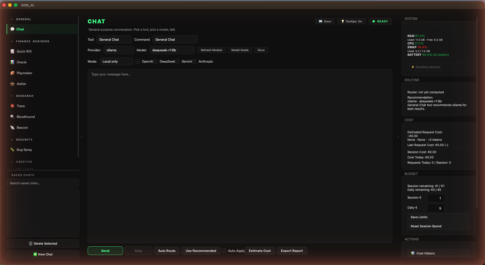

# Create & Publish — Documentation



**Version:** 1.0  
**Stack:** Python 3.11+ · PySide6 · SQLite · Ollama · Anthropic · OpenAI · DeepSeek · Gemini

Forked from `sentinel_ai` and stripped down to the creative/publishing agents —
see [FORK_PLAN.md](FORK_PLAN.md) for the split rationale and what has and
hasn't been done.

---

## Table of Contents

1. [Overview](#1-overview)
2. [Application Layout](#2-application-layout)
3. [Left Panel — Navigation & Chat History](#3-left-panel--navigation--chat-history)
4. [Centre Panel — Main Workspace](#4-centre-panel--main-workspace)
   - 4.1 [Control Bar — Row 1: Tool & Command](#41-control-bar--row-1-tool--command)
   - 4.2 [Control Bar — Row 2: Provider & Model](#42-control-bar--row-2-provider--model)
   - 4.3 [Control Bar — Row 3: Execution Mode & API Permissions](#43-control-bar--row-3-execution-mode--api-permissions)
   - 4.4 [Input Box](#44-input-box)
   - 4.5 [Action Row (Buttons)](#45-action-row-buttons)
   - 4.6 [Progress Bar & Status Label](#46-progress-bar--status-label)
   - 4.7 [Output Box](#47-output-box)
5. [Agents](#5-agents)
   - 5.1 [Chat Agent](#51-chat-agent)
   - 5.2 [Atelier Agent](#52-atelier-agent)
   - 5.3 [Manuscript Agent](#53-manuscript-agent)
   - 5.4 [Maestro Agent](#54-maestro-agent)
   - 5.5 [Site Builder Agent](#55-site-builder-agent)
   - 5.6 [Narrator Agent](#56-narrator-agent)
   - 5.7 [Publisher Agent](#57-publisher-agent)
   - 5.8 [Course Generator (CLI)](#58-course-generator-cli)
6. [Tools](#6-tools)
7. [Providers & Models](#7-providers--models)
   - 7.1 [Ollama (Local)](#71-ollama-local)
   - 7.2 [Anthropic (Claude)](#72-anthropic-claude)
   - 7.3 [OpenAI](#73-openai)
   - 7.4 [DeepSeek](#74-deepseek)
   - 7.5 [Gemini](#75-gemini)
8. [Routing & Execution Logic](#8-routing--execution-logic)
9. [Validation & Permission System](#9-validation--permission-system)
10. [Cost Tracking & Budgeting](#10-cost-tracking--budgeting)
11. [Right Panel — System Status](#11-right-panel--system-status)
12. [Dialogs & Popups](#12-dialogs--popups)
    - 12.1 [Cost History](#121-cost-history)
    - 12.2 [Run Log](#122-run-log)
    - 12.3 [Settings](#123-settings)
    - 12.4 [Model Guide](#124-model-guide)
    - 12.5 [Docs](#125-docs)
13. [Services Layer](#13-services-layer)
14. [Database Schema](#14-database-schema)
15. [File & Directory Structure](#15-file--directory-structure)
16. [First-Run & Migration](#16-first-run--migration)
17. [Configuration Reference](#17-configuration-reference)
18. [Earning Income with Create & Publish](#18-earning-income-with-create--publish)
    - 18.1 [Service-Based Income (Fiverr, Web Design, Author)](#181-service-based-income-fiverr-web-design-author)
    - 18.2 [Recurring Revenue (Music, Audiobook, Courses)](#182-recurring-revenue-music-audiobook-courses)
    - 18.3 [Required External Accounts & Tools](#183-required-external-accounts--tools)
    - 18.4 [Realistic Earnings Expectations](#184-realistic-earnings-expectations)

---

## 1. Overview

Create & Publish is a PySide6 desktop application for the creative/publishing
half of a wider split: it was forked from `sentinel_ai` (the full history is
still in `git log`), which kept the research/security agents, while this app
kept everything to do with writing, publishing, and selling creative work. It
acts as a unified command centre for interacting with multiple AI providers —
local (Ollama) and cloud (Anthropic, OpenAI, DeepSeek, Gemini). It provides:

- A multi-agent interface with specialised agents for different creative and
  publishing workflows.
- A permission and validation gate that enforces provider restrictions, tool
  rules, and cost budgets before any request is sent.
- Real-time cost estimation and post-request cost logging.
- A run log that records the full lifecycle of every AI request.
- A **Narrator** agent that converts ebooks to MP3 using OpenAI TTS, with progress tracking and quota-failure detection.
- A standalone, GUI-less **Course Generator** (`run_course.py`) that turns a topic into a packaged mini-course — slides, narration, and an avatar-presented video (see §5.8).
- A full Settings panel for configuring pricing, budgets, agents, and tools without touching any file.

The application is entirely self-contained: no server, no web interface, no external database. All data is stored in a local SQLite database (`data/create_and_publish.db`).

---

## 2. Application Layout

The window is divided into three columns, separated by draggable splitters:

| Column | Width | Purpose |
|--------|-------|---------|
| **Left panel** | ~230 px | Agent selection buttons + saved chat history |
| **Centre panel** | ~870 px (fills remaining space) | All input controls, agent-specific panels, output |
| **Right panel** | ~300 px | System resources, cost labels, budget controls, action buttons |

The window always opens maximised. The splitter widths are the default starting point; they can be dragged at runtime.

---

## 3. Left Panel — Navigation & Chat History

### Agent Buttons

The left panel groups agents into collapsible categories (each starts
collapsed — launch shows just the category list):

| Category | Agents |
|----------|--------|
| **General** | 💬 Chat |
| **Creative** | ✍️ Manuscript (author), 📚 Publisher (manuscript), 🎵 Maestro (music), 🎨 Site Builder (webdesign), 🎧 Narrator (audiobook) |
| **Gigs** | 💼 Atelier (fiverr) |

Clicking an agent button:
1. Highlights the button (green border, checked state).
2. Updates the hidden `agent_box` combo to match the selected agent name.
3. Calls `update_agent_ui()` which shows or hides the correct centre panel.

**Note:** "Writing" and "Coding" are **Tool** selections inside the Chat
agent's Tool combo (see Chapter 6) — they frame the same Chat panel with a
different system prompt, not separate agent classes. Dedicated
`WritingAgent`/`CodingAgent` classes existed before the fork's "strip the
security verticals" commit removed them along with the six deleted agents;
the Tool-based framing is what's left and still works.

---

### Saved Chats

Below the agent buttons:

**Search box** — Filters the chat list in real time. The filter is case-insensitive and matches against the chat title (agent name + first user message).

**History list** — Displays all saved chats from `data/chats/`, ordered newest-first. Each item shows the agent name and the first 52 characters of the initial user message. Clicking an item opens that chat.

**🗑 Delete Selected** — Permanently deletes the selected saved chat file after a confirmation prompt.

**✳️ New Chat** — Clears the input box, output box, and the current message history so a fresh conversation can begin. Does not delete any saved chats.

---

## 4. Centre Panel — Main Workspace

The centre panel contains one sub-panel per agent, mutually exclusive:

- **Normal panel** — shown for the Chat agent (any Tool, including Writing/Coding).
- **Audiobook panel** — shown when the Narrator (audiobook) agent is active.
- **Author panel** — shown when the Manuscript (author) writing-studio agent is active.
- **Music panel** — shown when the Maestro (music) agent is active.
- **Web Design panel** — shown when the Site Builder (webdesign) agent is active.
- **Fiverr panel** — shown when the Atelier (fiverr) agent is active.
- **Manuscript panel** — shown when the Publisher (manuscript) agent is active.

Below whichever sub-panel is active, the output area is always visible.

---

### 4.1 Control Bar — Row 1: Tool & Command

**Tool** (combo box) — Selects the active tool. A tool defines the system prompt sent to the model before the user's message. Available tools are loaded from the database (`tools` table). Default tools are:

| Tool name | Purpose |
|-----------|---------|
| General Chat | Open-ended conversation, no specific system framing |
| Writing | Professional writing assistance, editing, tone improvement |
| Coding | Code generation, debugging, explanation |
| Summarize | Condense long text into a concise summary |
| Rewrite | Rephrase or restructure existing text |

Changing the tool updates the live cost estimate and the recommendation label in real time.

**Command** (combo box) — Prepends a fixed prefix to the user's message before it is sent to the model. Commands are defined in `config/commands.json`. The default is `"General Chat"` which has no prefix. Custom commands can be added to that file.

---

### 4.2 Control Bar — Row 2: Provider & Model

**Provider** (combo box) — Selects the AI provider: `ollama`, `openai`, `deepseek`, or `gemini`. Changing the provider triggers `load_provider_models()` which repopulates the Model combo.

**Model** (combo box) — Selects the specific model for the chosen provider. The list is populated dynamically:

- **Ollama:** fetches the list of locally installed models via `ollama.list_models()`. Falls back to `deepseek-r1:8b` and `deepseek-r1:1.5b` if none are found.
- **OpenAI:** queries the API for available GPT/o-series models. Falls back to a static list (`gpt-4o-mini`, `gpt-4.1-mini`, `gpt-4.1`) if the API is unavailable.
- **DeepSeek:** queries the API if a key is configured; otherwise uses a static list including `deepseek-chat`, `deepseek-reasoner`, `deepseek-coder`.
- **Gemini:** queries the API for models supporting `generateContent`; otherwise uses a static list including `gemini-1.5-flash`, `gemini-2.0-flash`, `gemini-2.5-pro`.

The last selected model for each provider is saved to `config/settings.json` and restored on the next startup.

**Refresh Models** — Re-queries the provider for the current model list without changing any other setting. Useful after installing a new Ollama model or changing an API key.

**Model Guide** — Opens the Model Guide dialog (see Section 12.4).

**Docs** — Opens this documentation (see Section 12.5).

---

### 4.3 Control Bar — Row 3: Execution Mode & API Permissions

**Mode** (combo box) — Controls how the backend is resolved when the Send button is pressed:

| Mode | Behaviour |
|------|-----------|
| **Local only** | Always routes to Ollama, regardless of the Provider selection. No API cost. |
| **Hybrid allowed** | Uses the selected Provider. Cloud APIs require their checkbox to be enabled. |
| **Cloud only** | Forces a cloud provider. Ollama is not accepted. Fails immediately if the selected provider's checkbox is not ticked. |

**OpenAI** (checkbox) — Grants the application permission to call the OpenAI API for this session. Unchecked by default. Must be ticked before any request that would use OpenAI.

**DeepSeek** (checkbox) — Same as above for the DeepSeek API.

**Gemini** (checkbox) — Same as above for the Gemini API.

These checkboxes are a deliberate safety mechanism. Even if the provider is selected in the combo box, the request will be blocked by the validator if the matching checkbox is unchecked. This prevents unexpected API spend.

---

### 4.4 Input Box

A multi-line text field where the user types their message. The minimum height is 190 px.

Every change to the input box triggers two reactive updates:
1. `update_live_cost_estimate()` — recalculates the estimated token count and cost shown in the right panel.
2. `update_recommendation_label()` — updates the recommendation label with a revised provider suggestion based on the current text.
3. `maybe_auto_apply_recommendation()` — if the **Auto-Apply** checkbox is ticked, automatically applies the recommended provider/model/mode whenever the input text changes.

---

### 4.5 Action Row (Buttons)

| Button | Function |
|--------|----------|
| **Send** | Validates and sends the current prompt. Disabled while a request is running. |
| **Stop** | Cancels the running request or audiobook process. Enabled only while a request is active. |
| **Auto Route** | Resolves and displays the current agent/provider/model in the Router label without sending anything. Useful for checking what setup will be used. |
| **Use Recommended** | Reads the current agent, tool, and prompt, determines the recommended provider/model, and applies it to the Provider, Model, and Mode controls. Also updates the Recommendation label. |
| **Auto-Apply** (checkbox) | When ticked, `Use Recommended` is called automatically every time the input text changes. |
| **Estimate Cost** | Opens a popup showing the estimated token count and cost for the current input, based on the selected provider and model. |
| **Export Report** | Saves the current output box contents as a plain-text report to `data/reports/`. The filename is `<agent>_report_<timestamp>.txt`. Shows a confirmation with the full path. |

---

### 4.6 Progress Bar & Status Label

A progress bar and a status label appear below the action row only while a request is in progress. They are hidden otherwise.

The **progress bar** runs in indeterminate mode (animating, no percentage) because LLM response time is not predictable.

The **status label** shows elapsed time and a rough estimated time remaining, updated every second:

```
Processing... elapsed 00:12 · rough remaining 00:18
```

The time estimate is computed from the backend, model size, and prompt length. It is a rough guide only.

---

### 4.7 Output Box

A read-only text area that displays the model's response, status messages, and error notices. Content is streamed token-by-token for streaming-capable backends; for non-streaming backends, the response is emitted word-by-word to give the visual impression of streaming.

The output box is also used by the Audiobook agent to display conversion logs and the Manager agent to show spec review messages.

---

## 5. Agents

Create & Publish ships with 7 first-party GUI agents, each defined by its own Python class in `agents/` and a tailored system prompt, plus one CLI-only Course Generator with no left-panel entry at all (§5.8). The left-panel navigator groups the GUI agents into three collapsible categories — General, Creative, Gigs; clicking an agent button either loads the standard Chat panel or swaps the centre area for a fully custom GUI built for that workflow. Most agents support all of Ollama (local), Anthropic, OpenAI, DeepSeek, and Gemini — Narrator is the exception, since it only ever calls OpenAI TTS (§5.6) — and most expose a Help button that opens this documentation at the relevant section. Anthropic Claude (Sonnet or Opus) typically gives the most structured output for the writing/publishing agents; Ollama works offline at no cost; the other cloud providers are interchangeable and chosen by taste, latency, or budget.

### 5.1 Chat Agent

**Left-panel button:** 💬 Chat  (category: **General**)

The default, general-purpose agent. Chat is the one agent that does *not* swap in a custom panel — it runs inside the standard centre panel (Tool combo, Command combo, prompt input, output box) described in Section 4. Use it for anything that doesn't have a dedicated specialist agent: open-ended questions, code help, drafting, summarisation, translation, follow-up conversation, brainstorming.

---

#### What the Chat Agent Does

The Chat agent simply builds a single-user-message payload from the prompt input and forwards it, along with whichever Tool is active (General Chat, Writing, Coding, Summarize, Rewrite — see Chapter 6), to the chosen provider. After the first reply, the assistant's response is appended to `current_messages` so follow-ups include full conversation context. Saved chats are persisted as JSON files in `data/chats/` and re-appear in the **Saved Chats** list in the left panel.

---

#### Panel Layout

Chat uses the **standard `normal_panel`** described in Chapter 4 (no custom GUI). The centre panel exposes:

| Element | Purpose |
|---------|---------|
| **Tool** combo | Selects the system prompt prepended to every message (General Chat by default). |
| **Command** combo | Optional pre-built prompt scaffolds from `config/commands.json`. |
| **Provider** combo | Ollama / Anthropic / OpenAI / DeepSeek / Gemini. |
| **Model** combo | Auto-populated based on provider. |
| **Prompt input** | Multi-line message box. |
| **Send / Stop** buttons | Send the prompt or cancel the in-flight request. |
| **Output box** | Streaming response display; conversation history is preserved within the session. |
| **✳️ New Chat** | Clears `current_messages` and starts a fresh conversation. |
| **🗑 Delete Selected** | Removes the selected saved chat from `data/chats/`. |

---

#### How to Use — Step by Step

1. Click **💬 Chat** in the **General** category of the left panel.
2. Pick a **Tool** if you want a domain frame (e.g. Coding, Writing).
3. Optionally pick a **Command** template.
4. Choose **Provider** and **Model**.
5. Type a message in the prompt input and click **Send** (or press the configured submit shortcut).
6. The response streams into the output box. Type a follow-up to continue the same conversation.
7. Use **✳️ New Chat** to clear context and start over. The previous conversation is auto-saved to `data/chats/`.
8. To re-open an older chat, click it in the **Saved Chats** list.

---

#### External Requirements

- **Ollama** (local) needs Ollama installed and at least one model pulled (`ollama pull llama3.1`).
- **Anthropic / OpenAI / DeepSeek / Gemini** require their respective API keys — see Chapter 7.

---

#### Tips & Limitations

> The Chat agent has no built-in tool-use, web browsing, or file uploads — it is plain text in, plain text out. There is no dedicated research/investigation agent in this fork (that stayed with `sentinel_ai`); Chat with the Writing or Coding tool is as close as this app gets.

> Long conversations grow `current_messages` linearly; the entire history is re-sent on each turn. Use **New Chat** liberally to keep token costs down on paid providers.

---

#### Agent Class Reference

| Property | Value |
|----------|-------|
| Agent class | `agents/chat_agent.py` — `ChatAgent` |
| Agent name (DB) | `chat` |
| Label | Chat |
| Default panel | Standard `normal_panel` (no custom GUI) |
| Allowed providers | All five |
| System prompt | None directly — uses the active Tool's system prompt |

---

### 5.2 Atelier Agent

**Left-panel button:** 💼 Atelier  (category: **Gigs**)

A logo-design freelancer assistant. The Fiverr agent generates **DALL-E 3 logo concepts**, a polished **delivery message** for the client, and a complete **Fiverr gig description** — all from a single client brief form. Image generation runs through OpenAI's DALL-E 3 API; the text deliverables can use any provider.

---

#### What the Atelier Agent Does

Three distinct outputs, generated independently:

1. **Logo concepts** — The agent first asks the text LLM to write a 1–3 sentence DALL-E-ready prompt from the brief, then sends that prompt to **DALL-E 3** (`dall-e-3`, standard quality, $0.04 per image) to render 1–4 logo concepts. Outputs are PNGs saved under `data/fiverr_output/<timestamp>/`.
2. **Delivery message** — A friendly, professional, under-200-word note from freelancer to client. Structure: warm opening → what was delivered and why → revision offer → sign-off.
3. **Gig description** — A complete Fiverr listing under 400 words: hook headline, what the buyer gets (bullets), why choose this gig, Basic/Standard/Premium package overview, call to action.

---

#### Fiverr Panel Layout

##### Client Brief (form group)

| Field | Description |
|-------|-------------|
| **Business Name** | e.g. Apex Fitness Studio. **Required for image generation.** |
| **Industry / Niche** | e.g. fitness, law firm, bakery. |
| **Style** | Minimalist / Bold / Vintage / Playful / Corporate / Luxury / Futuristic. |
| **Primary Colors** | Free text — `navy blue and gold` or `#1a1a2e, #e94560`. |
| **# Concepts** | 1–4 logo concepts (spin box, default 2). |
| **Notes** | Optional tagline, mood, audience, competitors to avoid. |
| **Text Provider / Model** | Default Anthropic — used for prompt-building and copy generation. |

##### Action Row

| Button | Action |
|--------|--------|
| **Generate Logos** | Builds the DALL-E prompt and renders N concepts. |
| **Write Delivery Msg** | Generates the under-200-word client delivery note. |
| **Write Gig Description** | Generates the Fiverr listing copy. |
| **Stop** | Cancels the current job. |

##### Results Tabs

| Tab | Content |
|-----|---------|
| **Logo Preview** | Live grid of generated concepts as thumbnails. Includes a **Save All Images** button. |
| **Delivery Message** | Editable text area with the generated message. |
| **Gig Description** | Editable text area with the gig listing. |

##### Sidebar

| Section | Content |
|---------|---------|
| **Status** | Live status text. |
| **Est. Cost** | DALL-E 3 cost estimate (`~$0.04 × N` images). |
| **Order Log** | A small table (Business, # concepts, Status) tracking every generation run during the session. |

A **Clear** button at the bottom resets the panel.

---

#### How to Use — Step by Step

1. Click **💼 Atelier** under **Finance & Business**.
2. Fill in **Business Name**, **Industry**, **Style**, and **Primary Colors**.
3. Choose how many concepts to render (1–4) and add optional notes.
4. Pick **Text Provider** + **Model** for the prompt-and-copy LLM.
5. Click **Generate Logos**. The status shows "Building image prompt…" then "Generating N concept(s)…". Thumbnails appear in the Logo Preview tab as each render completes.
6. Click **Save All Images** to copy the PNGs out of `data/fiverr_output/<timestamp>/`.
7. When you are ready to ship to a client, click **Write Delivery Msg** — the Delivery Message tab fills with a copy-ready note.
8. To productise the offering, click **Write Gig Description** — the Gig Description tab fills with a complete Fiverr listing.
9. The **Order Log** sidebar tracks each run; **Clear** wipes everything.

---

#### External Requirements

- **OpenAI API key** with billing enabled — DALL-E 3 image generation is OpenAI-only. Cost is approximately **$0.04 per standard-quality 1024×1024 image**.
- Optional: account on **Fiverr** (https://fiverr.com) to publish the gig and deliver to clients. No Fiverr API integration — copy/paste the generated content.
- Optional: a vector tool (Illustrator, Affinity Designer, Vectorizer.AI) to convert the raster PNG concepts into final vector logos before delivery.

---

#### Tips & Limitations

> The DALL-E-3 prompt is built to force "vector logo, transparent background, no text" — but the result is still a raster PNG. Vectorise before final client delivery.

> The text LLM is used twice per logo run: once to build the image prompt, once for whatever copy task you trigger.

> See Chapter 18 for the full Fiverr monetisation playbook — pricing, packages, and delivery cadence.

---

#### Agent Class Reference

| Property | Value |
|----------|-------|
| Agent class | `agents/fiverr_agent.py` — `FiverrAgent` |
| Agent name (DB) | `fiverr` |
| Label | Atelier |
| Default text provider | Anthropic |
| Image provider | OpenAI (DALL-E 3) — hard-coded |
| External worker | `FiverrImageWorker` (in `main.py`) — threaded image generation |
| System prompt | Three modes: delivery message, gig description, DALL-E prompt builder |

---

### 5.3 Manuscript Agent

**Left-panel button:** ✍️ Manuscript  (category: **Creative**)

A full creative writing suite for novelists, screenwriters, short-story writers, and bloggers. The panel has **three distinct modes** accessed via a toggle at the top: a manuscript workspace for drafting, and a Publish & Market system for producing everything needed to take a finished book to market — from query letters and synopses to Amazon copy and Instagram posts.

---

#### What the Manuscript Agent Does

The agent operates through system prompts that vary by mode — Write mode additionally switches between a fiction and a non-fiction prompt based on the **Type** field:

**Write mode** — fiction (creative writing specialist):
- **[DRAFT]** — Prose in the specified POV, tone, and genre.
- **[OUTLINE]** — Act/chapter/scene-beat breakdown with purpose for each beat.
- **[CHARACTER]** — Name, role, backstory, motivation, arc, voice, relationships.
- **Free-form** — World-building, revision notes, craft advice.

Writing principles baked in: show-don't-tell, scene-level tension/change/revelation, dialogue with subtext, prose rhythm matched to genre, consistent POV/tense, hooky scene endings.

**Write mode** — non-fiction (argument-driven writing specialist, for self-help/memoir/business/narrative non-fiction):
- **[DRAFT]** — Chapter prose in the established voice and register.
- **[OUTLINE]** — Part/chapter breakdown with the argument or takeaway each chapter delivers.
- **Free-form** — Strengthening an argument, structural notes, revision, cutting for length.

Writing principles baked in: one clear takeaway per chapter, concrete examples over abstract claims, consistent voice across chapters, address the obvious counterargument, cut ruthlessly.

Switching **Type** also swaps the **Task** dropdown: fiction gets Write Scene / Develop Characters / Build World / Write Dialogue; non-fiction gets Write Chapter / Strengthen Argument / Add Case Study / Tighten Structure. Both share Continue Draft, Generate Outline, and Revise / Improve.

**Publish mode** (publishing specialist):
- Produces professional-grade publishing documents: synopses, query letters, book proposals, back-cover blurbs, author bios, chapter breakdowns.
- Each document type has specific word-count targets and structural conventions enforced by the system prompt (e.g. 1-page synopsis = 400–500 words, always reveals the ending; back-cover blurb = 100–150 words, never reveals the ending).

**Market mode** (book marketing copywriter):
- Produces platform-native marketing copy for 15 platforms, each with different tone and format rules built into the prompt.
- Platforms: Amazon Description, KDP Listing, Goodreads Blurb, Instagram Post, Twitter/X Thread, TikTok Caption, Pinterest Pin Description, YouTube Description, Newsletter, Press Release, Book Club Questions, ARC Outreach Email, Launch Team Email, Podcast Pitch, Author Website Bio.

**All three modes** read from one **Book Profile** — see below — so Title, Author, Hook, Target Reader, Comp Titles, and Publishing Path don't need re-entering per mode or per request.

---

#### Panel Layout

##### Project Bar (top strip — shared across all modes)

| Field | Description |
|-------|-------------|
| **Title** | Project title — used in all generated documents. |
| **Author** | Pen name / author name — used in exports and injected into every mode's context. |
| **Type** | Fiction / Non-Fiction — switches Write mode's system prompt and Task list. |
| **Genre** | Literary Fiction / Thriller / Fantasy / Sci-Fi / Horror / Romance / Historical / Mystery / Short Story / Screenplay / Poetry / Blog / Essay / Other. |
| **Tone** | Neutral / Dark / Humorous / Lyrical / Tense / Romantic / Gritty / Whimsical / Philosophical / Commercial. |
| **POV** | Third Person Limited / First Person / Third Person Omniscient / Second Person. |

##### 📖 Book Profile (collapsible, below the Project Bar)

| Field | Description |
|-------|-------------|
| **Hook** | One-sentence pitch — the core promise of the book. |
| **Target reader** | Who the book is for, specifically. |
| **Comp titles** | Comparable published titles. |
| **Publishing path** | Undecided / Self-Publishing (KDP) / Traditional. |
| **💾 Save Profile** | Persists the whole profile (including Title/Author/Type from the Project Bar) to the settings DB — auto-loads on next launch. |

This is injected as a "BOOK CONTEXT" block into every Write, Publish, and Market request. Collapsed by default; expand once, fill it in, save — it carries forward automatically after that.

##### Mode Toggle

| Button | Description |
|--------|-------------|
| **✍️ Write** | Switches to the manuscript workspace (write, outline, characters, world notes). |
| **📣 Publish & Market** | Switches to the Publish & Market panel. |

---

##### ✍️ Write Mode

###### Workspace Tabs

| Tab | Purpose |
|-----|---------|
| **✍️ Draft** | Your manuscript draft. Editable. Word and scene counts update live. |
| **📋 Outline** | Chapter and scene outline. Editable. |
| **👤 Characters** | Character profiles, arcs, relationships. Editable — automatically fed into every Write/Continue request so generated scenes stay consistent with what's already established. |
| **🌍 World Notes** | World-building, lore, setting rules. Editable — same auto-injection as Characters. |
| **📑 Chapters** | Read-only. Parses the Draft live (on tab switch) into a numbered chapter list with per-chapter word counts, detected from `Chapter N` / `Part N` / `Prologue` / `Epilogue` headings. Double-click a chapter to jump the Draft cursor there. |

###### Sidebar (right)

| Element | Purpose |
|---------|---------|
| **Direction** | Free-text — what to write, the next scene, revision instructions. |
| **Task** | Write Scene / Continue Draft / Generate Outline / Develop Characters / Build World / Write Dialogue / Revise / Improve. |
| **Provider / Model** | Default Anthropic. Shared by all three modes. |
| **✍️ Write** | Sends the brief; output streams into the relevant tab depending on Task. |
| **▶ Continue** | Appends to the existing draft from the cursor position — does not clear. |
| **⬛ Stop** | Cancels the in-flight request. |
| **Words** | Live word count of the Draft tab (large, prominent, updates on every token). |
| **Scenes / Chapters** | Live scene count parsed from chapter/scene headings and scene breaks. |
| **💾 Save Draft** | Saves the current Draft tab to `.txt` or `.md`. |
| **Author name** | Name printed on the export title page (not the same as the Project Bar title). |
| **Format + 📤 Export Book** | Renders the Draft tab to **EPUB**, **DOCX**, or **PDF** — title page + auto-detected chapter breaks. No external tools required (EbookLib / python-docx / reportlab). |
| **Clear All** | Clears all four tabs and resets the project bar. |

---

##### 📣 Publish & Market Mode

A sub-toggle row switches between **📄 Publish** and **📢 Market**. Both pages follow the same layout: a large editable output area on the left, a control sidebar on the right.

###### 📄 Publish Page

| Control | Options / Description |
|---------|-----------------------|
| **Output Type** | Synopsis — 1 Page · Synopsis — 3 Page · Query Letter · Book Proposal · Back-Cover Blurb · Author Bio · Chapter Breakdown. |
| **Word Count Target** | Optional manuscript word count (used to calibrate document length and market context). |
| **Comp Titles** | Comparable titles — e.g. "Gone Girl meets Dark Places". Used in the query letter and book proposal. |
| **Pitch Tone** | Professional · Conversational · High-Concept. |
| **Extra Notes** | Target audience, themes, hook, additional context for the agent. |
| **Generate** | Streams the document into the output area. |
| **Stop** | Cancels in-flight generation. |
| **Copy to Clipboard** | Copies the full output. |
| **Save as File** | Saves to `.txt` or `.md` with an auto-generated filename from the project title and document type. |

Document standards enforced by the Publish system prompt:

| Document | Word target | Key rule |
|----------|-------------|----------|
| Synopsis — 1 Page | 400–500 words | Reveals the ending. Present tense. No cliffhangers. |
| Synopsis — 3 Page | 750–900 words | Full arc, character, and subplots. Still reveals ending. |
| Query Letter | 250–350 words | Hook · Story overview · Author bio. Formal but engaging. |
| Book Proposal | Full document | Overview, market analysis, chapter summaries, platform, sample note. |
| Back-Cover Blurb | 100–150 words | Hook first. Build tension. End on a promise — never reveal ending. |
| Author Bio | 75–150 words | Third person. Credentials + warm personal line. |
| Chapter Breakdown | Per chapter | 2–4 sentence summaries, numbered, present tense. |

###### 📢 Market Page

| Control | Options / Description |
|---------|-----------------------|
| **Platform** | Amazon Description · KDP Listing · Goodreads Blurb · Instagram Post · Twitter/X Thread · TikTok Caption · Pinterest Pin Description · YouTube Description · Newsletter · Press Release · Book Club Questions · ARC Outreach Email · Launch Team Email · Podcast Pitch · Author Website Bio. |
| **Hook / Logline** | One sentence that captures the book's core appeal. |
| **Comp Titles** | Comparable titles used for audience targeting. |
| **Tone** | Punchy · Literary · Warm · Hype · Mysterious. |
| **Extra Notes** | Target audience, mood, key themes. |
| **Generate** | Streams the platform-specific copy. |
| **Stop** | Cancels in-flight generation. |
| **Copy to Clipboard** | Copies the full output. |
| **Save as File** | Saves to `.txt` or `.md`. |

Platform format rules enforced by the Market system prompt:

| Platform | Format |
|----------|--------|
| Amazon Description | 150–300 words. Short paragraphs. CTA at end. No markdown headers. |
| KDP Listing | Full package: title+subtitle, 2 BISAC categories, 7 backend keywords (real search phrases, not hashtags, ≤50 chars each), pricing guidance with reasoning, plus the Amazon Description. |
| Goodreads Blurb | 100–200 words. Slightly more literary tone than Amazon. |
| Instagram Post | 100–200 words + 3–5 hashtags. Emoji-friendly. |
| Twitter/X Thread | 5–8 tweets, each ≤ 280 chars. Hook tweet first, numbered. |
| TikTok Caption | 50–80 words. Conversational. 3–5 #BookTok hashtags. |
| Pinterest Pin Description | 100–150 words. Keyword-rich for search. No hashtags. Soft CTA. |
| YouTube Description | 150–250 words. Hook above the fold. Searchable keywords + links. |
| Newsletter | 200–350 words. Personal tone. Soft CTA. |
| Press Release | 300–450 words. Headline + dateline + 3–4 paragraphs + boilerplate. |
| Book Club Questions | 8–12 open-ended discussion questions on theme and character. |
| ARC Outreach Email | 150–200 words. Professional pitch to reviewers/bloggers. |
| Launch Team Email | 150–200 words. Recruits early reviewers/ambassadors — what they get, what you're asking in return. |
| Podcast Pitch | 150–200 words. Why this book, why this author, why now. |
| Author Website Bio | 150–250 words. SEO-friendly. First or third person. |

---

#### How to Use — Step by Step

**Writing a new book:**

1. Click **✍️ Manuscript** in the left panel.
2. Fill in the **Project Bar**: Title, Author, Type (Fiction/Non-Fiction — this sets the Task list below), Genre, Tone, POV.
3. Expand **📖 Book Profile** and fill in Hook, Target Reader, Comp Titles, Publishing Path — then click **💾 Save Profile**. Do this once; it persists across restarts and feeds Write, Publish, and Market automatically from here on.
4. In the **Write** sidebar, pick Task: `Generate Outline`. Write a brief in Direction.
5. Select **Provider / Model** (Claude Opus or GPT-4o for best prose).
6. Click **✍️ Write** — the outline streams into the Outline tab.
7. Switch Task to `Write Scene` (or `Write Chapter` for non-fiction). Write the scene/chapter brief in Direction.
8. Click **✍️ Write** — draft appears in the Draft tab.
9. Click **▶ Continue** to extend from where the draft ends.
10. Edit directly in any tab — they are all fully editable. Check **📑 Chapters** any time for a live word-count breakdown.
11. Click **💾 Save Draft** for a plain-text backup, or pick a **Format** and click **📤 Export Book** for a submittable EPUB/DOCX/PDF. Add `Chapter 1`, `Chapter 2`, etc. as line headings in the Draft to get real chapter breaks in the export — without them, the whole draft exports as one chapter.

**Preparing to publish:**

1. Click **📣 Publish & Market** to enter the publishing workspace.
2. Click **📄 Publish** (sub-toggle).
3. Choose **Output Type** — start with `Back-Cover Blurb` for a fast hook test.
4. Fill in **Comp Titles**, **Word Count Target**, and any **Extra Notes**.
5. Select **Pitch Tone** (Professional for query submissions; High-Concept for pitching agents cold).
6. Click **Generate**. Edit the output directly in the output area.
7. Click **Copy to Clipboard** or **Save as File**.
8. Repeat for `Query Letter`, `Synopsis — 1 Page`, `Author Bio` as needed. If you've saved a **Book Profile**, its Hook/Target Reader/Comp Titles are already grounding every generation — the per-request **Comp Titles** field here is for overriding, not required.

**Creating marketing copy:**

1. Still in **📣 Publish & Market**, click **📢 Market** (sub-toggle).
2. Choose **Platform** — start with `Amazon Description`, or `KDP Listing` for the full categories/keywords/pricing package.
3. Enter your **Hook / Logline** and **Comp Titles** (optional if a Book Profile is saved — see above).
4. Select **Tone** and add any **Extra Notes**.
5. Click **Generate**. The copy streams in platform-native format.
6. Edit, copy, or save as needed.
7. Repeat for each platform: Goodreads, Instagram, Pinterest, Newsletter, etc.

---

#### External Requirements

- LLM provider API key. Claude Opus or GPT-4o produce the highest-quality long-form prose and publishing documents.
- Export needs no external tools or paid software — EPUB/DOCX/PDF generation is fully local (`EbookLib` / `python-docx` / `reportlab`).
- Optional: **Scrivener** or **Ulysses** to import saved drafts into a full manuscript workflow.
- Optional: **Reedsy Studio** (free) or **Vellum** (Mac, $249) for cover design and more elaborate print-ready typesetting than the built-in export provides.

---

#### Tips & Limitations

> The word count updates on every keystroke — for very long drafts (> 100k words) this may introduce a small lag.

> Tasks route output to the correct tab automatically: `Generate Outline` → Outline tab, `Develop Characters` → Characters tab. Make sure the right Task is selected before clicking Write.

> **Continue** appends to the existing draft without clearing it. **Write** starts fresh. Use Write for new scenes, Continue to extend a scene in progress.

> The Publish and Market pages both use the **Provider / Model** set in the Write sidebar. Make sure a model is selected before switching modes.

> Publish and Market outputs are editable — the agent produces a first draft, not a final document. Always review and personalise before submitting to agents or posting publicly.

> The agent makes creative choices rather than asking clarifying questions — "prefer action over paralysis." You can always redirect with a follow-up call.

> **Export** detects chapters from heading lines (`Chapter 1`, `Part II`, `Prologue`, `Epilogue` — plain or markdown-prefixed). A draft with no such headings still exports fine, just as a single chapter — add headings before exporting if you want real chapter breaks in the EPUB/PDF table of contents.

> **Chapters** uses the same heading detection as Export — the same "add headings for structure" rule applies. It's a live view, not a stored model: nothing is lost or duplicated if you edit the Draft directly, it just re-parses next time you open the tab.

> **Consistency memory** only sends what's actually in the Characters/World tabs — an empty project sends nothing extra. For a long draft, the recent-draft excerpt sent on fresh Write calls is capped at the last ~3,000 characters to keep cost bounded; Continue instead sends the full existing draft (unchanged prior behavior), so the two aren't stacked on top of each other.

> **Type** (Fiction/Non-Fiction) only affects the Write-mode system prompt and Task list — Publish and Market already handled both from the start (see the fiction-vs-non-fiction split baked into `PUBLISH_SYSTEM_PROMPT`). Switching Type mid-project is safe; it doesn't touch anything you've already written.

> **Book Profile** fields are independent of the Publish/Market pages' own per-request Hook/Comp Titles fields — the profile grounds the system prompt, the per-request fields are still there for overriding on a specific document. Leave the per-request fields blank to rely entirely on the saved profile.

---

#### Agent Class Reference

| Property | Value |
|----------|-------|
| Agent class | `agents/author_agent.py` — `AuthorAgent` |
| Agent name (DB) | `author` |
| Label | Manuscript |
| Default provider | Anthropic |
| Write system prompt | `SYSTEM_PROMPT` (fiction) or `SYSTEM_PROMPT_NONFICTION`, selected by `content_type`; fiction markers `[DRAFT] / [OUTLINE] / [CHARACTER] / [WORLD]`, non-fiction uses `[DRAFT] / [OUTLINE]` only |
| Publish system prompt | Document-by-document standards; word-count targets; pitch tone rules |
| Market system prompt | Platform-by-platform format rules; 15 platforms incl. KDP Listing; copy principles |
| Methods | `build_messages()` · `build_publish_messages()` · `build_market_messages()` — all three accept `book_profile_context`; `build_messages()` also takes `content_type` |
| Export | `services/book_exporter.py` — `export_book()` (EPUB/DOCX/PDF), called by `main.py: author_export_book()` |
| Book Profile | `main.py: _author_get_book_profile()/_author_build_book_profile_block()`, persisted via `author_save_profile()`/`_author_load_profile()` (settings DB, key `author_book_profile`) |
| Consistency memory | `main.py: _author_build_consistency_context()` — auto-injects Characters/World + recent draft into `build_messages()`'s `consistency_context` param |
| Chapters navigator | `services/book_exporter.py: find_chapter_offsets()`, `main.py: _author_refresh_chapters()/_author_jump_to_chapter()` |

---

### 5.4 Maestro Agent

**Left-panel button:** 🎵 Maestro  (category: **Creative**)

A Spotify Artist Setup specialist that produces a complete, copy-paste-ready release-and-monetisation plan for independent artists. The agent's system prompt forces every response to mark **[AI OUTPUT — COPY-PASTE READY]** vs **[HUMAN ACTION REQUIRED]** so you always know which bits to paste and which require manual steps in Spotify for Artists, DistroKid, etc.

---

#### What the Maestro Agent Does

Five-section release plan:

1. **ARTIST PROFILE** — Short bio (150 chars), Long bio (300–500 words), genre tags, artist description, 3 similar artists, plus the human steps to paste into Spotify for Artists.
2. **RELEASE SETUP** — release title options, track listing, track descriptions, release date recommendation, cover art spec, ISRC/UPC explainer, file-prep checklist.
3. **DISTRIBUTION GUIDE** — comparison of DistroKid / TuneCore / CD Baby with prices/royalty/pros/cons, recommended choice with reasoning, step-by-step signup walkthrough.
4. **SPOTIFY STRATEGY** — Editorial Playlist Pitch (≤500 chars), Spotify Canvas brief, profile optimisation checklist, 5 independent playlist curator targets, plus how to submit pitches and upload Canvas.
5. **INCOME ROADMAP** — streaming revenue projections at 1k/10k/100k streams, revenue streams beyond streaming (sync, merch, live, Patreon/Bandcamp, Content ID), 1/3/6-month priorities, tools to track earnings, PRO/SoundExchange registration steps.

---

#### Music Panel Layout

##### Artist Setup (form group)

| Field | Description |
|-------|-------------|
| **Artist / Project Name** | e.g. Nova Drift, The Hollow Road. |
| **Genre** | Pop / Rock / Hip-Hop / Electronic / Jazz / Classical / R&B / Metal / Indie / Folk / Country / Latin / Reggae / Ambient / World / Other. |
| **Release Type** | Single / EP (3–6 tracks) / Album (7+) / Mixtape. |
| **Distributor** | Not signed up yet / DistroKid / TuneCore / CD Baby / Amuse / AWAL / Other. |
| **Target Audience** | Optional — demographic and listener profile. |
| **Describe Your Music** | Multi-line — sound, influences, vibe, release concept. |
| **Provider / Model** | Default Anthropic. |

##### Action Buttons

| Button | Action |
|--------|--------|
| **Generate Plan** | Sends the brief; the five sections stream into the tabs. |
| **Stop** | Cancels the request. |
| **Help** | Opens this documentation. |
| **Save Full Plan** | Saves the complete plan as a single `.txt`. |
| **Clear** | Resets the form and tabs. |

##### Results Tabs

One tab per section: **Artist Profile**, **Release Setup**, **Distribution**, **Spotify Strategy**, **Income Roadmap**.

##### Sidebar

| Section | Content |
|---------|---------|
| **Release Type** | Echoes the selected release type. |
| **Genre** | Echoes the selected genre. |
| **Distributor** | Echoes the distributor (or `Not signed up yet`). |
| **Procedure** | A static 5-step checklist (Profile → Release → Distribution → Strategy → Income). |

---

#### How to Use — Step by Step

1. Click **🎵 Maestro** under **Creative**.
2. Fill in **Artist / Project Name**, **Genre**, **Release Type**, **Distributor**, and **Describe Your Music**.
3. (Optional) Specify **Target Audience**.
4. Pick **Provider** and **Model** (Claude works well for long structured plans).
5. Click **Generate Plan**.
6. Step through the five tabs. The Artist Profile and Spotify Strategy tabs contain copy-paste-ready text — paste directly into Spotify for Artists. The Distribution and Income Roadmap tabs contain human-action steps you'll need to follow manually.
7. Click **Save Full Plan** to keep the complete document.

---

#### External Requirements

- **Spotify for Artists** account — claim your artist profile at https://artists.spotify.com (free).
- A **digital distributor** — the agent recommends one of:
  - **DistroKid** (https://distrokid.com) — ~$22.99/year unlimited uploads, 100 % royalty.
  - **TuneCore** (https://tunecore.com) — per-release pricing, 100 % royalty.
  - **CD Baby** (https://cdbaby.com) — flat per-release fee, 91 % royalty.
- **Cover art** — 3000×3000 px JPG/PNG, no logos/text overlays per Spotify guidelines.
- **PRO registration** — ASCAP/BMI/SESAC (US), PRS (UK), SOCAN (Canada) for performance royalties. SoundExchange for digital performance royalties.
- LLM provider API key.

---

#### Tips & Limitations

> Every section explicitly separates AI output (paste) from human steps (do). Read the `[HUMAN ACTION REQUIRED]` blocks carefully — uploading and pitching can't be done by the agent.

> The editorial-playlist pitch is capped at 500 characters (Spotify's actual limit); the bio sections cap at the lengths Spotify accepts. Don't expand them or pitches will be truncated.

> Streaming revenue estimates use $0.003–$0.005/stream — real per-stream payouts vary by country and account type.

> Monetisation strategy in depth — see Chapter 18.

---

#### Agent Class Reference

| Property | Value |
|----------|-------|
| Agent class | `agents/music_agent.py` — `MusicAgent` |
| Agent name (DB) | `music` |
| Label | Maestro |
| Default provider | Anthropic |
| System prompt | Music business consultant; five-section format with AI/human action markers; real distributor names and prices |

---

### 5.5 Site Builder Agent

**Left-panel button:** 🎨 Site Builder  (category: **Creative**)

A front-end design and prototyping agent. Given a brief, Web Design produces complete, self-contained HTML / CSS / JS — landing pages, portfolios, dashboards, forms, blogs, or single components — split across three editable tabs and ready to copy or save as an `.html` file.

---

#### What the Site Builder Agent Does

When invoked with a brief, the agent delivers a single complete code block (or three) covering:

- Semantic HTML5 (`<header>`, `<main>`, `<section>`, `<article>`, `<footer>`).
- Mobile-first responsive CSS using flexbox or grid.
- CSS custom properties for colours and spacing.
- Vanilla ES6+ JavaScript (no jQuery) by default; Tailwind or Bootstrap if requested.
- Hover/focus states and basic accessibility (aria, alt, tab order).

The panel splits the output into HTML / CSS / JS tabs and computes line counts for the sidebar.

---

#### Web Design Panel Layout

##### Quick Setup (form group)

| Field | Description |
|-------|-------------|
| **Page Type** | Landing Page / Portfolio / Dashboard / Form / Blog / Component / Widget / Other. |
| **Style** | Minimal / Dark / Corporate / Playful / Brutalist. |
| **Colour Palette** | Free text — hex codes or named palette. |
| **Framework** | Vanilla / Tailwind / Bootstrap. |
| **Brief** | Multi-line description of sections, features, content, interactions. |
| **Provider / Model** | Default Anthropic. |

##### Action Buttons

| Button | Action |
|--------|--------|
| **Generate** | Sends the brief; output streams into the tabs. |
| **Stop** | Cancels the request. |
| **Copy All** | Copies the combined HTML/CSS/JS to the clipboard. |
| **Save .html** | Saves a single self-contained `.html` file. |
| **Clear** | Resets everything. |

##### Results Tabs

| Tab | Content |
|-----|---------|
| **HTML** | The HTML output. |
| **CSS** | The CSS output (or empty if Tailwind/Bootstrap is used inline). |
| **JS** | The JavaScript output. |

##### Sidebar

| Indicator | Description |
|-----------|-------------|
| **Responsive** | Yes/No based on detected media queries. |
| **Framework Used** | Echoes the selected framework. |
| **Lines of Code** | Total LoC across the three tabs. |

---

#### How to Use — Step by Step

1. Click **🎨 Site Builder** under **Creative**.
2. Pick **Page Type** and **Style**.
3. Enter a **Colour Palette** (or leave blank to let the model propose one).
4. Choose a **Framework**.
5. Write the **Brief** — be specific about sections, features, content, and interactions.
6. Pick **Provider** and **Model**.
7. Click **Generate**.
8. Review the HTML / CSS / JS tabs.
9. Click **Save .html** to save a self-contained file, or **Copy All** to paste into your editor.

---

#### External Requirements

- LLM provider API key.
- A browser to preview the generated `.html`.
- Optional: a real editor (VS Code, Sublime) to refine and integrate.

---

#### Tips & Limitations

> The agent always tries to produce a single self-contained file by default. Ask explicitly for separate files in the Brief if you want them.

> When you pick Tailwind or Bootstrap, expect minimal custom CSS — most styling will be utility classes in the HTML tab.

> The Brutalist style is intentionally rough; pick Minimal or Corporate for production-ready aesthetics.

---

#### Agent Class Reference

| Property | Value |
|----------|-------|
| Agent class | `agents/webdesign_agent.py` — `WebdesignAgent` |
| Agent name (DB) | `webdesign` |
| Label | Site Builder |
| Default provider | Anthropic |
| System prompt | Senior front-end developer; semantic HTML5; mobile-first; CSS custom properties; ES6+; W3C-valid output |

---

### 5.6 Narrator Agent

**Left-panel button:** 🎧 Narrator  (category: **Creative**)

A completely separate workflow that converts ebook files into MP3 audiobooks using OpenAI's Text-to-Speech API. The Audiobook agent is unusual in two ways: (1) it does not stream LLM output — it runs an **external Python script** as a subprocess, and (2) it has no system-prompt-style "agent class" beyond a thin **AudiobookConnector** that parses configuration input. The conversion engine lives in the sibling project at `narrator/`.

---

#### What the Narrator Agent Does

For a selected ebook (PDF / EPUB / TXT / MOBI), the engine:

1. Extracts the book's text content.
2. Chunks it (default 1400 tokens per chunk).
3. Sends each chunk to OpenAI TTS (`alloy`, `verse`, `aria`, `coral`, or `sage` voice).
4. Concatenates the returned audio into a single MP3 (or per-chapter MP3s).
5. Writes the output to the configured output folder.

The conversion runs as a `QProcess` so the GUI stays responsive. Output is streamed live into the centre output box. Progress is reported as a percentage via the panel's progress bar.

---

#### Audiobook Panel Layout

##### Select a Book to Convert (group box)

| Element | Purpose |
|---------|---------|
| **Book list** | Populated from the configured input folder. Supports `.pdf`, `.epub`, `.txt`, `.mobi`. |
| **🔄 Refresh List** | Re-scans the input folder. |
| **▶ Start** | Begins conversion of the selected book (confirmation dialog first). |
| **⛔ Stop** | Kills the running conversion subprocess. |

##### Conversion Settings (group box)

| Element | Purpose |
|---------|---------|
| **Input Folder** | Read-only — source folder for ebooks. |
| **Open** | Opens the input folder in Finder. |
| **Output Folder** | Read-only — destination for MP3s. |
| **Change** | Folder picker to redirect output for the current session. |
| **Voice** | Combo: `alloy` / `verse` / `aria` / `coral` / `sage`. |
| **Chunk Tokens** | Default 1400 — smaller = more API calls but smaller individual chunks. |
| **Estimated cost** | A rough file-size-based cost estimate for the selected book. |

##### Progress (group box)

| Element | Purpose |
|---------|---------|
| **Progress bar** | Percentage based on chunk progress reported by the engine. |
| **Status label** | `[Ready]` / `[Running] X% (N/M)` / `[Done]` / `[Blocked]` / `[Paused]` / `[Error]` / `[Stopped]`. |

##### Status Detection

| Subprocess Output | Status |
|-------------------|--------|
| Non-zero exit | `[Error]` |
| `insufficient_quota` / `exceeded your current quota` / `Billing hard limit` | `[Blocked]` — directs to OpenAI billing |
| `Conversion paused` | `[Paused]` — click Start to resume |
| `ALL BOOKS COMPLETED` or 🎉 | `[Done]` |
| Any other clean exit | `[Finished]` |

---

#### How to Use — Step by Step

1. Drop one or more ebooks into the configured input folder.
2. Click **🎧 Narrator** under **Creative**.
3. Click **🔄 Refresh List** to populate the book list.
4. Pick a **Voice** and (optionally) adjust **Chunk Tokens**.
5. If you want a different output destination, click **Change**.
6. Select a book and click **▶ Start**.
7. Confirm the cost estimate in the dialog.
8. Watch the progress bar and live log; if you hit quota issues, the panel will explain where to top up.
9. Find the finished MP3(s) in the output folder when the status reads `[Done]`.

---

#### External Requirements

- **OpenAI API key** with TTS credit — TTS is approximately **$15 per 1M input characters** (roughly 250 typical novels per $100). Standard quality.
- The **`narrator/` sibling project** must be installed and its virtual environment configured. See `/Users/as/Documents/lab/active/narrator/` (additional working directory).
- Disk space for output MP3s — a typical novel renders to ~150–250 MB.
- Optional: an MP3 player or audiobook app (Apple Books, Plex Audiobooks) for playback.

---

#### Tips & Limitations

> The Audiobook agent has **no LLM provider selector** — the only AI involved is OpenAI TTS. Other Sentinel providers are irrelevant here.

> If conversion is `[Blocked]`, top up OpenAI billing then click **▶ Start** again — partial progress is preserved.

> Smaller chunk tokens mean more API calls and slightly more cost; larger chunks risk hitting API per-request limits. The default 1400 is a good trade-off.

---

#### Agent Class Reference

| Property | Value |
|----------|-------|
| Connector class | `agents/audiobook_connector.py` — `AudiobookConnector` (parses `input=`/`output=`/`voice=`/`chunk_tokens=` config) |
| Engine | External script `narrator/ebook_to_audiobook.py` (separate venv) |
| Agent name (DB) | `audiobook` |
| Label | Narrator |
| Provider | OpenAI TTS — hard-coded; no provider switching |
| System prompt | None — this is a process-runner, not an LLM agent |

---

### 5.7 Publisher Agent

**Left-panel button:** 📚 Publisher  (category: **Creative**)

Picks up where the Manuscript (writing studio) agent stops: real sales data, launch-content generation, and a publishing checklist. Five tabs: **Overview**, **Quote Finder**, **Quote Graphics**, **Shorts**, **Calendar**.

---

#### What the Publisher Agent Does

**Overview tab:**
- Pulls PublishDrive sales/royalty data for a selected period (Last 30 days / This month / Last 7 days / All time).
- Ingests KDP sales CSVs dropped into `data/kdp_reports/`, deduplicated by filename.
- A chat sidebar answers questions grounded in the last-fetched sales JSON (`ManuscriptAgent.build_messages()` injects it as system-prompt context — the agent is instructed not to fabricate figures).
- A publishing todo checklist, auto-seeded on first use with a standard launch list (KDP upload, Draft2Digital, IngramSpark, cover files, description, categories, pricing, ARC requests, BookBub, influencer outreach).

**Quote Finder tab:**
- Load the manuscript directly (`.txt` / `.pdf` / `.epub` / `.mobi` via `services/narrator/converter.py: load_text()`) or paste an excerpt.
- **Suggest Quotes** sends the text to the LLM with a prompt that requires every returned quote to be an exact, verbatim substring of the source — no paraphrasing. Returned as a JSON array, parsed with a markdown-fence-aware parser and a line-based fallback.
- Each candidate quote appears as a row with two inline one-click buttons: **🖼** generates a graphic immediately, **🎬** generates a narrated short — no retyping, no switching tabs.

**Quote Graphics tab:**
- Renders a single quote as a styled PNG: 3 themes (Midnight / Blush / Zodiac), 2 sizes (1080×1080 square, 1080×1920 vertical).
- Pure Pillow — gradient background + wrapped serif text + optional attribution line. No API call, no cost.

**Shorts tab:**
- Narrates a quote via TTS (macOS `say` by default — free, no API key; ElevenLabs optional for higher-quality voices) and combines it with a quote-graphic PNG into a vertical MP4 via a single `ffmpeg -loop 1 -i image -i audio` call — runs on a background thread (`ShortsWorker`) so the UI stays responsive.

**Calendar tab:**
- Distributes the Quote Finder candidates across a posting schedule — TikTok 4×/week (short), Instagram 3×/week (alternating graphic/short), Pinterest 7×/week (graphic) — cycling quotes if there are more slots than quotes. Pure scheduling, no LLM call, deterministic.
- One batched LLM call writes a platform-native caption per post (all at once, not one call per row) — TikTok casual with hashtags, Instagram warmer, Pinterest keyword-rich with no hashtags.
- Every row has a one-click 🖼/🎬 button using the exact same generation code as Quote Finder/Shorts.
- **Export Calendar (CSV)** writes the full schedule — date, platform, format, quote, caption — for manual posting.

---

#### Panel Layout

##### Overview Tab

| Control | Description |
|---------|-------------|
| **Period** | Last 30 days / This month / Last 7 days / All time. |
| **⟳ Refresh Data** | Fetches PublishDrive sales for the selected period. |
| **📥 Ingest KDP CSV** | Parses any new CSVs in `data/kdp_reports/`. |
| **Ask box + Provider/Model** | Chat Q&A grounded in the last-fetched sales JSON. |
| **Publishing Todos** | List + Add/Done — persisted in the `manuscript_todos` table. |

##### Quote Finder Tab

| Control | Description |
|---------|-------------|
| **Manuscript text** | Paste an excerpt directly. |
| **📄 Load File…** | `.txt` / `.pdf` / `.epub` / `.mobi` — extracts full text via the Narrator converter. |
| **Quotes** | How many candidates to request (5 / 10 / 15 / 20). |
| **Theme / Voice / Attribution** | Applied to every graphic/short generated from this tab's candidates. |
| **🔍 Suggest Quotes** | Runs the extraction prompt; populates the candidate list. |
| **🖼 / 🎬 per row** | One-click graphic or narrated short for that specific quote. |

##### Quote Graphics Tab

| Control | Description |
|---------|-------------|
| **Quote / Attribution** | Text to render. |
| **Theme** | Midnight / Blush / Zodiac. |
| **Size** | Square (1080×1080) / Story-Reel-Pin (1080×1920). |
| **✨ Generate Graphic** | Renders and previews the PNG; saved to `data/quote_graphics/`. |
| **📂 Open Folder** | Reveals the output folder. |

##### Shorts Tab

| Control | Description |
|---------|-------------|
| **Quote / Attribution** | Also used verbatim as the narration script. |
| **Theme** | Same 3 themes as Quote Graphics. |
| **Voice source** | System (Free) or ElevenLabs. |
| **Voice** | Populated from the selected source. |
| **🎬 Generate Short** | Narrates + renders on a background thread; saved to `data/shorts/`. |
| **▶ Play / 📂 Folder** | Open the last-generated short or its folder. |

##### Calendar Tab

| Control | Description |
|---------|-------------|
| **Weeks** | 1 / 2 / 4 — length of the schedule. |
| **Start** | Calendar-picker start date. |
| **TikTok / Instagram / Pinterest** | Checkboxes — which platforms to schedule. |
| **Theme / Voice / Attribution** | Applied to every asset generated from this tab. |
| **📅 Generate Calendar** | Builds the schedule (instant), then writes all captions in one LLM call. |
| **Table rows** | Date, Platform, Format, Quote, Caption, and a 🖼/🎬 action button per row. |
| **📤 Export Calendar (CSV)** | Saves the full schedule + captions to a CSV file. |

---

#### How to Use — Step by Step

**Checking sales and staying on top of launch tasks:**

1. Click **📚 Publisher** in the left panel.
2. Set `PUBLISHDRIVE_API_KEY` in `.env` (once) to enable live sales data.
3. Click **⟳ Refresh Data** for the current period, or **📥 Ingest KDP CSV** after dropping a report into `data/kdp_reports/`.
4. Ask a question in the sidebar ("What did I earn this month?") — answered from the fetched data, not guessed.
5. Work through the **Publishing Todos** checklist; add your own items as they come up.

**Turning a manuscript into a batch of social content:**

1. Switch to **Quote Finder**.
2. Click **📄 Load File…** and select the finished manuscript (or paste a chapter).
3. Set quote count, theme, voice, and attribution.
4. Click **🔍 Suggest Quotes** — candidates appear as a list.
5. Click **🖼** on any quote for an instant graphic, or **🎬** for a narrated vertical short.
6. Repeat across candidates to build a week's batch in minutes — upload manually to TikTok/Instagram/Pinterest (see Tips below on why posting isn't automated).

**Scheduling a full week/month in one pass:**

1. Run **Suggest Quotes** on Quote Finder first — Calendar reads its candidate list.
2. Switch to **Calendar**, pick weeks, start date, and platforms.
3. Click **📅 Generate Calendar** — the schedule appears instantly, captions stream in a few seconds later.
4. Click 🖼/🎬 on any row to produce that asset immediately, or work through the table at your own pace.
5. Click **📤 Export Calendar (CSV)** for a day-by-day file to post from manually (or hand to whoever manages your socials).

---

#### External Requirements

- **PublishDrive API key** (`PUBLISHDRIVE_API_KEY` in `.env`) for live sales data — optional, the rest of the panel works without it.
- **ElevenLabs API key** (`ELEVENLABS_API_KEY`) for higher-quality short narration — optional, macOS `say` is the free default.
- **ffmpeg** (already required elsewhere in the project, e.g. Narrator/course video) for Shorts.
- LLM provider key for Quote Finder's extraction step and the Overview Q&A sidebar.

---

#### Tips & Limitations

> Quote Finder truncates very long manuscripts to the first ~30,000 characters per request to keep cost bounded — paste or load a specific chapter for more targeted picks on a long book.

> The agent does not post to social platforms itself, and does not create social media accounts — both are either against platform terms for automated tools or require an app-review process (Meta, TikTok) that isn't worth building for a single-author use case. Graphics/shorts are generated locally; posting is a manual step, or route through a scheduler like Buffer/Metricool if you want that automated.

> Shorts generation blocks the Generate button and disables all Quote Finder row 🎬 buttons while one short is rendering — Calendar rows share the same lock, since both use the same background worker slot. Only one narration/encode runs at a time across the whole panel.

> Nothing on this panel writes back into the manuscript — it only consumes a finished or in-progress draft. Drafting, editing, and EPUB/DOCX/PDF export live on the Manuscript writing-studio agent (§5.3), not here.

> Calendar's captions are a single batched LLM call covering every scheduled post at once — if that call fails, the schedule still populates with blank captions rather than losing the whole batch; regenerate to retry.

---

#### Agent Class Reference

| Property | Value |
|----------|-------|
| Agent class | `agents/manuscript_agent.py` — `ManuscriptAgent` |
| Agent name (DB) | `manuscript` |
| Label | Publisher |
| Default provider | Anthropic (Overview tab; shared by Quote Finder) |
| System prompts | Sales Q&A grounding prompt · PublishDrive/KDP JSON-extraction prompts · verbatim quote-suggestion prompt · calendar-caption prompt |
| Methods | `build_messages()` · `build_publishdrive_parse_messages()` · `build_kdp_parse_messages()` · `build_quote_suggestions_messages()` · `build_calendar_caption_messages()` |
| Supporting services | `services/publishdrive_client.py` · `services/kdp_csv_parser.py` · `services/quote_graphics.py` · `services/shorts_generator.py` · `services/content_calendar.py` |
| DB tables | `manuscript_metrics` · `manuscript_kdp_ingested` · `manuscript_todos` |

---

### 5.8 Course Generator (CLI)

**No left-panel button — this one runs from the terminal, not the GUI.**

`run_course.py` drives `agents/course_agent.py` to generate a full mini-course
(modules → lessons → slides → narrated, avatar-presented video → a packaged
`index.html`) from a single topic string. It has no left-panel entry, no
`agent_box` row, and isn't wired into `main.py` at all — it is a standalone
pipeline, invoked directly:

```bash
python run_course.py --topic "Python for Beginners" --modules 2 --lessons 2
python run_course.py --topic "Data Science" --avatar heygen --voice elevenlabs
```

**Pipeline (`services/course/`):**

| Stage | Module | What it does |
|-------|--------|---------------|
| Content | `content_generator.py` | Anthropic-generated module/lesson outline and script text |
| Slides | `slide_generator.py` | Renders lesson slide images |
| Voice | `providers/voice/` | `mock` (free, no key) or `elevenlabs` narration audio |
| Avatar | `providers/avatar/` | `mock`, `heygen`, or `synthesia` presenter video |
| Assembly | `video_assembler.py` | Combines slides + narration + avatar into the final video per lesson |
| Packaging | `packager.py` | Writes `output/courses/<course>/index.html` plus assets |

**Requirements:** `ANTHROPIC_API_KEY` in `.env` always; `ELEVENLABS_API_KEY` only
if `--voice elevenlabs`; a HeyGen or Synthesia key only if `--avatar` selects
that provider. `--avatar mock --voice mock` (the defaults) runs the whole
pipeline free, useful for testing the flow before spending on real voice/avatar
generation.

**Output:** written to `--output` (default `output/courses/`), which is
gitignored — open `index.html` in a browser to review the generated course.

---

## 6. Tools

Tools define the system prompt that frames the conversation. The active tool is selected from the Tool combo box in the centre panel. The system prompt is prepended to every message sent to the model.

Tools are stored in the `tools` table in the database and can be enabled/disabled in the Settings panel (see Section 12.3). Custom tools can be added to the database directly — the agent-factory workflow that used to generate them (the Forge agent) was removed along with the security verticals; see [FORK_PLAN.md](FORK_PLAN.md).

| Tool | Intended use |
|------|-------------|
| General Chat | No domain framing — open-ended conversation |
| Writing | Tone, structure, professional quality for documents |
| Coding | Code generation, debugging, refactoring |
| Summarize | Condense long content to key points |
| Rewrite | Rephrase while preserving meaning |

Tools may also have a `recommended_provider` and `recommended_model` which the recommendation engine uses when that tool is selected.

---

## 7. Providers & Models

### 7.1 Ollama (Local)

Ollama runs locally on your machine. No API key is required, no data leaves your computer, and there is no cost.

**Best for:** general chat, simple tasks, drafts, private data, offline usage.

**API key:** not required.

**Model discovery:** `ollama.list_models()` queries the local Ollama daemon. Falls back to `deepseek-r1:8b` / `deepseek-r1:1.5b` if the daemon is unavailable.

**Common models:** `deepseek-r1:8b`, `deepseek-r1:1.5b`, `llama3`, `mistral`, `phi3`

---

### 7.2 Anthropic (Claude)

Requires an `ANTHROPIC_API_KEY` environment variable. Get your key at **console.anthropic.com → API Keys**.

**Best for:** coding, writing, nuanced reasoning, document analysis, instruction-following. Claude is particularly strong at following complex instructions and producing well-structured output.

**Model discovery:** queries the Anthropic API for available models, falls back to the static list below.

| Model | Tier | Input / 1M tokens | Output / 1M tokens | Best for |
|-------|------|-------------------|---------------------|----------|
| `claude-opus-4-7` | Flagship | $15.00 | $75.00 | Most complex reasoning, long documents, hard coding problems |
| `claude-sonnet-4-6` | Balanced | $3.00 | $15.00 | Best all-round choice — coding, writing, analysis |
| `claude-haiku-4-5-20251001` | Fast | $0.80 | $4.00 | Simple tasks, quick turnaround, high-volume use |
| `claude-3-5-sonnet-20241022` | Prev. gen | $3.00 | $15.00 | Previous Sonnet — still highly capable |
| `claude-3-5-haiku-20241022` | Prev. gen | $0.80 | $4.00 | Previous Haiku — fast and affordable |
| `claude-3-opus-20240229` | Prev. gen | $15.00 | $75.00 | Previous Opus |
| `claude-3-haiku-20240307` | Prev. gen | $0.25 | $1.25 | Previous cheapest model |

**Recommended model:** `claude-sonnet-4-6` for most tasks.

---

### 7.3 OpenAI

Requires an `OPENAI_API_KEY` environment variable. Get your key at **platform.openai.com → API Keys**.

**Best for:** complex reasoning, polished writing, professional documents, production-quality code. Also the only provider for Audiobook TTS.

**Model discovery:** queries `client.models.list()` and filters for GPT and o-series models.

| Model | Notes |
|-------|-------|
| `gpt-4o-mini` | Fast and affordable. Good for everyday tasks. |
| `gpt-4.1-mini` | Improved mini model. Better reasoning than gpt-4o-mini. |
| `gpt-4.1` | Full model. Best quality for demanding tasks. |
| `o1` / `o3` / `o4-mini` | Reasoning models. Slow but excellent for hard logic. |

---

### 7.4 DeepSeek

Requires a `DEEPSEEK_API_KEY` environment variable. Get your key at **platform.deepseek.com**.

**Best for:** structured analysis, coding assistance, analytical long-form text. Often lower cost than OpenAI for comparable output quality.

**Model discovery:** queries the DeepSeek API or falls back to a static list.

| Model | Notes |
|-------|-------|
| `deepseek-chat` | General-purpose. Strong for coding and analysis. |
| `deepseek-reasoner` | Extended reasoning. Good for multi-step logic. |
| `deepseek-coder` | Specialised for code generation and debugging. |

---

### 7.5 Gemini

Requires a `GOOGLE_API_KEY` environment variable. Get your key at **console.cloud.google.com**.

**Best for:** broad summaries, very long context windows, general fallback.

**Model discovery:** queries `client.models.list()` for models supporting `generateContent`.

| Model | Notes |
|-------|-------|
| `gemini-2.5-pro` | Most capable. Excellent long-context handling. |
| `gemini-2.5-flash` | Fast and cost-effective. Good for summaries. |
| `gemini-2.0-flash` | Previous generation Flash. Solid general use. |
| `gemini-1.5-pro` | 1M token context window. Best for very long documents. |
| `gemini-1.5-flash` | Affordable fallback for most tasks. |

---

## 8. Routing & Execution Logic

### Execution Mode

The Mode combo box controls how `resolve_backend_model()` determines the final provider and model:

**Local only:**  
Always returns `("ollama", <current model>)`. Provider and API checkbox settings are ignored. The request never touches a cloud API.

**Hybrid allowed:**  
Uses the selected Provider. If the provider is `ollama`, it returns Ollama. If the provider is a cloud API, the matching API checkbox must be ticked; otherwise a `RuntimeError` is raised and the request is blocked.

**Cloud only:**  
Provider must not be `ollama`. The selected cloud API's checkbox must be ticked. A `RuntimeError` is raised if these conditions are not met.

### Auto Route

The **Auto Route** button calls `auto_route_agent()`, which resolves the current backend/model and updates the Router label in the right panel — without sending anything. Use it to confirm what setup will be used before committing to a potentially paid request.

### Recommendation Engine

`get_recommended_setup()` analyses the current agent, tool, command, and prompt text to suggest a provider and model:

| Signal in text / context | Recommendation |
|--------------------------|---------------|
| Audiobook agent | OpenAI TTS (forced) |
| Keywords: `debug`, `code`, `function`, `refactor`, `traceback` | DeepSeek → OpenAI → Ollama |
| Keywords: `write`, `email`, `cv`, `professional`, `polish` | OpenAI → Gemini → Ollama |
| Tool has a `recommended_provider` | That provider (if API is enabled), else Ollama |
| Default / general task | Ollama |

API availability is respected: if the recommended cloud API's checkbox is unchecked, the engine falls back to the next option.

**Use Recommended** applies the suggestion to the controls immediately.  
**Auto-Apply** ticks a checkbox so this happens automatically as you type.

---

## 9. Validation & Permission System

Every request goes through `Validator.validate()` before the worker thread is started. Ten checks are evaluated in order. The first failure blocks the request and shows a descriptive message:

| # | Check | Blocks if |
|---|-------|-----------|
| 1 | Agent enabled | Agent is disabled in the registry |
| 2 | Tool enabled | Tool is disabled in the registry |
| 3 | Provider allowed for agent | Agent's `allowed_providers` list does not include the selected provider |
| 4 | Provider allowed for tool | Tool's `allowed_providers` list does not include the selected provider |
| 5 | Tool allowed for agent | Agent's `allowed_tools` list does not include the selected tool (`null` = unrestricted, `[]` = none allowed) |
| 6 | API checkbox | A cloud provider is selected but its checkbox is unchecked |
| 7 | Per-agent budget | Estimated cost exceeds the agent's `budget_limit_eur` daily cap |
| 8 | Session budget | Estimated cost would exceed the remaining session budget |
| 9 | Daily budget | Estimated cost would exceed the remaining daily budget |
| 10 | Requires approval | Agent has `requires_approval = true` |

If all ten checks pass, a `ValidationResult(allowed=True)` is returned and the request proceeds.

If any check fails, a `ValidationResult(allowed=False, reason=<explanation>)` is returned, the request is blocked, and a warning dialog is shown with the reason.

---

## 10. Cost Tracking & Budgeting

### Cost Estimation (Pre-Request)

Before sending, `estimate_chat_cost()` provides a rough estimate based on character count:

- Input tokens ≈ `len(prompt) / 4`
- Output tokens ≈ `input_tokens × 1.2` (minimum 250)
- Cost = `total_tokens × price_per_token` for the current provider

This estimate drives three things: the live estimate label in the right panel, the cost estimate popup, and the budget validation checks. It is intentionally conservative.

### Confirmation Dialog (Pre-Request)

For any cloud provider, a confirmation dialog is shown before the worker starts, displaying the provider, model, approximate tokens, and estimated cost. The user must click **Yes** to proceed.

### Actual Cost (Post-Request)

After a successful response, `UsageTracker.log_request()` calculates the real cost:

1. Token counts are sourced from the API's usage response if available (field names vary by provider: `input_tokens`, `prompt_tokens`, `prompt_token_count`, etc.). If exact data is unavailable, character-count estimation is used.
2. The EUR/USD exchange rate and per-model pricing are read from the `pricing` and `settings` tables in the database.
3. A row is inserted into the `usage` table with timestamp, agent, provider, model, token counts, cost, and cost type (`exact`, `estimated`, or `mixed`).

### Budget Controls

**Session budget** — Total cloud spend allowed in the current app session. Resets when you click Reset Session Spend or restart the app.

**Daily budget** — Total cloud spend allowed today (per calendar day). Aggregated from the `usage` table.

Budget limits are checked by the validator before each request. They are editable in the right panel's input fields or in the Settings dialog.

**Save Budget Limits** — Saves the current input field values to the database (settings table) and to the in-memory state. Applied immediately.

**Reset Session Spend** — Resets only the in-memory session accumulator to zero. Does not delete usage log entries.

---

## 11. Right Panel — System Status

The right panel is a vertically scrolling status board inside a **System Status** group box.

### Resource Monitor

A fixed-height HTML label displaying live system stats, updated every second:

| Metric | Colour coding |
|--------|--------------|
| RAM % and GB used/free | Green < 60%, Yellow < 85%, Red ≥ 85% |
| CPU % | Same thresholds |
| Swap % and GB used/total | Same thresholds |
| Battery % and charging state | Green if charging or > 40%, Yellow > 20%, Red ≤ 20% |

**⚡ Realtime Monitor** — Reserved button, currently disabled. Planned for a future full resource monitor dialog.

### Request & Cost Labels

| Label | Content |
|-------|---------|
| **Router** | Last used routing decision: `agent · provider · model` |
| **Recommendation** | Current recommendation from the engine, updates as you type |
| **Estimated Request Cost** | Live pre-send estimate based on the current input; shows "FREE (local)" for Ollama |
| **Last Request Cost** | Actual cost of the most recently completed request, including agent and provider |

A visual divider separates the request-level labels above from the session/daily totals below.

### Session & Daily Totals

| Label | Content |
|-------|---------|
| **Session Cost** | Total cloud spend since the app was last started |
| **Cost Today** | Total cloud spend for today, from the database |
| **Requests Today / Session** | Request counts for the daily and session periods |
| **Budget** | Remaining session budget and daily budget, shown as used/limit |

### Budget Inputs & Controls

**Session budget (€)** — Editable field for the session spend ceiling.

**Daily budget (€)** — Editable field for the daily spend ceiling.

**Save Budget Limits** — Persists the input values to the database and updates in-memory state immediately.

**Reset Session Spend** — Zeroes the session accumulator without affecting the database.

### Action Buttons

| Button | Opens |
|--------|-------|
| **Cost History** | Cost History dialog (filterable, exportable CSV) |
| **Run Log** | Run Log dialog (filterable by status and agent) |
| **⚙ Settings** | Settings dialog (General, Agents, Tools, Pricing tabs) |

### API Key Status

Three read-only labels show whether each cloud API key is detected in the environment:

- `OpenAI Key: ✅ available` / `❌ not set`
- `DeepSeek Key: ✅ available` / `❌ not set`
- `Gemini Key: ✅ available` / `❌ not set`

---

## 12. Dialogs & Popups

### 12.1 Cost History

Opened by the **Cost History** button. Shows the full usage log from the `usage` table.

**Provider filter** — Filters the table to a single provider or shows all.

**Summary bar** — Displays total requests, total tokens, and total cost for the filtered view.

**Table columns:** Timestamp · Agent · Provider · Model · Input tokens · Output tokens · Total tokens · Cost (€) · Cost type

**Export CSV** — Saves the filtered rows to a CSV file at a user-chosen path.

---

### 12.2 Run Log

Opened by the **Run Log** button. Shows the 500 most recent run records from the `runs` table.

**Status filter** — `all`, `success`, `error`, or `cancelled`.

**Agent filter** — Filters to a specific agent or shows all.

**Summary bar** — Shows total runs, error count, and total cost for the filtered view.

**Table columns:** Timestamp · Run ID · Agent · Tool · Provider · Model · Status · Input tokens · Output tokens · Cost (€) · Duration (s) · Error message

Status values are colour-coded: green (success), red (error), amber (cancelled).

---

### 12.3 Settings

Opened by the **⚙ Settings** button. A tabbed dialog with four sections.

#### General Tab

| Field | Description |
|-------|-------------|
| EUR / USD rate | Conversion rate used for cost calculations |
| Default session budget (€) | Starting value for the session budget input on startup |
| Default daily budget (€) | Starting value for the daily budget input on startup |

#### Agents Tab

Lists every agent from the `agents` table with:

- **Enabled** checkbox — Toggle the agent on or off.
- **Budget cap (€)** — Per-day spending cap for this agent. Leave blank for no limit.

#### Tools Tab

Lists every tool from the `tools` table with:

- **Enabled** checkbox — Toggle the tool on or off.
- **System Prompt preview** — First 80 characters of the tool's system prompt (read-only).

#### Pricing Tab

Shows every row in the `pricing` table with editable fields:

- **Input /1M USD** — Cost per million input tokens for this provider/model.
- **Output /1M USD** — Cost per million output tokens.

Pricing rows are created during the initial migration from `config/pricing.json` and can be updated here.

#### Save All

Persists all changes to the database in a single transaction. Also refreshes the in-memory registry and validator so changes take effect immediately without restarting the app.

**Cancel** — Closes the dialog without saving.

If any field contains an invalid number, a warning lists all errors. Valid changes are still saved.

---

### 12.4 Model Guide

Opened by the **Model Guide** button. A four-tab reference dialog.

**Models tab** — Guidance on when to use each provider: Ollama, OpenAI, DeepSeek, Gemini, and Audiobook mode.

**Agents tab** — Guidance on each agent's purpose and recommended provider.

**Routing tab** — Explanation of Execution Mode options and API checkboxes.

**System tab** — Live system information: current mode/provider/model selection, API key availability for all four cloud providers (Anthropic, OpenAI, DeepSeek, Gemini), list of installed Ollama models, and a contextual recommendation based on the current agent and command.

**Search bar** — Filters all tabs to show only those containing the search term. Tabs without a match show a "No matches" notice.

---

### 12.5 Docs

Opened by the **Docs** button. Renders this file (`README.md`) inside a scrollable `QTextBrowser` using the `markdown` library. If the file is not found, a placeholder message is shown.

---

## 13. Services Layer

All business logic is separated from the GUI into dedicated service classes in `services/`.

| File | Class | Responsibility |
|------|-------|---------------|
| `database.py` | — (module) | SQLite connection, schema creation, JSON migration, `get_setting` / `save_setting` |
| `registry.py` | `Registry` | Read agents and tools from the database; provider/tool permission queries |
| `validator.py` | `Validator` | Ten-check permission gate evaluated before every request |
| `usage_tracker.py` | `UsageTracker` | Token normalisation, cost calculation, usage log writes and reads |
| `run_logger.py` | `RunLogger` | Start/finish/cancel lifecycle for every AI request run |
| `agent_factory.py` | `AgentFactory` | Write agent Python files and database entries from a JSON spec |
| `ollama_client.py` | `OllamaClient` | Ollama API wrapper: `list_models()`, `chat()`, `generate()`, streaming |
| `openai_client.py` | `OpenAIClientWrapper` | OpenAI API wrapper: `chat()`, `stream_chat()` |
| `deepseek_client.py` | `DeepSeekClientWrapper` | DeepSeek API wrapper (OpenAI-compatible): `chat()`, `stream_chat()` |
| `gemini_client.py` | `GeminiClientWrapper` | Gemini API wrapper: `chat()`, `stream_chat()` |
| `history_store.py` | `HistoryStore` | Save and load conversation JSON files in `data/chats/` |
| `report_exporter.py` | `ReportExporter` | Write output content to timestamped text files in `data/reports/` |
| `resource_monitor.py` | `ResourceMonitor` | `snapshot()` returns CPU, RAM, swap, and battery stats via `psutil` |
| `tool_runner.py` | `ToolRunner` | Loads tool configuration (paths, venv, defaults) for the Audiobook tool |
| `model_router.py` | `ModelRouter` | Stateless helper for provider/model selection logic |

### ChatWorker (main.py)

`ChatWorker` is a `QThread` subclass that runs the LLM call on a background thread to keep the GUI responsive. It handles three response formats:

- **Generator/streaming:** emits each token via `token_signal` as it arrives.
- **Tuple `(response, usage)`:** extracts the response string and usage dict, emits tokens in a simulated stream.
- **Plain string:** emits tokens in a simulated stream.

Signals:

| Signal | Carries | Connected to |
|--------|---------|-------------|
| `token_signal` | One token string | `handle_chat_token` — appends to output box |
| `status_signal` | Status message | `handle_chat_status` — appends to output box |
| `finished_signal` | Full response string | `handle_chat_finished` — logs usage, saves history |
| `error_signal` | Error message | `handle_chat_error` — logs error, re-enables Send |
| `usage_signal` | Usage dict | `handle_chat_usage` — stores for post-request cost logging |

---

## 14. Database Schema

The SQLite database is stored at `data/create_and_publish.db`. All tables use WAL journal mode and foreign key enforcement.

### `agents`

| Column | Type | Description |
|--------|------|-------------|
| `name` | TEXT PK | Unique snake_case identifier |
| `label` | TEXT | Display name shown in the UI |
| `enabled` | INTEGER | 1 = active, 0 = disabled |
| `version` | TEXT | Schema version string |
| `allowed_providers` | TEXT | JSON array of permitted provider names |
| `allowed_tools` | TEXT | JSON array of permitted tool names, or NULL for unrestricted |
| `budget_limit_eur` | REAL | Daily spend cap in EUR, or NULL for no limit |
| `requires_approval` | INTEGER | 1 = blocked until manually approved |
| `description` | TEXT | Human-readable description |
| `log_path` | TEXT | Log file path (legacy, now superseded by DB logging) |
| `auto_generated` | INTEGER | 1 = created by the agent factory. Always 0 today — Forge and `services/agent_factory.py` were removed with the security verticals; the column is a schema vestige. |

### `tools`

| Column | Type | Description |
|--------|------|-------------|
| `name` | TEXT PK | Unique tool name |
| `label` | TEXT | Display name |
| `enabled` | INTEGER | 1 = active, 0 = disabled |
| `version` | TEXT | Schema version string |
| `allowed_providers` | TEXT | JSON array of permitted providers |
| `budget_limit_eur` | REAL | Daily spend cap for this tool |
| `requires_approval` | INTEGER | 1 = requires manual approval |
| `description` | TEXT | Tool description |
| `system_prompt` | TEXT | The full system prompt prepended to every message |
| `recommended_provider` | TEXT | Provider suggested by the recommendation engine |
| `recommended_model` | TEXT | Model suggested by the recommendation engine |

### `usage`

| Column | Type | Description |
|--------|------|-------------|
| `id` | INTEGER PK | Auto-increment |
| `timestamp` | TEXT | ISO 8601 timestamp (seconds precision) |
| `agent` | TEXT | Agent name |
| `backend` | TEXT | Provider used |
| `model` | TEXT | Model used |
| `input_tokens` | INTEGER | Prompt tokens |
| `output_tokens` | INTEGER | Completion tokens |
| `total_tokens` | INTEGER | Sum of input + output |
| `cost_eur` | REAL | Calculated cost in EUR |
| `cost_type` | TEXT | `exact`, `estimated`, or `mixed` |
| `cloud` | INTEGER | 1 if a cloud API was used |

### `runs`

| Column | Type | Description |
|--------|------|-------------|
| `id` | INTEGER PK | Auto-increment |
| `run_id` | TEXT UNIQUE | 8-character UUID fragment assigned at request start |
| `timestamp` | TEXT | ISO 8601 timestamp |
| `agent` | TEXT | Agent name |
| `tool` | TEXT | Tool name |
| `provider` | TEXT | Provider used |
| `model` | TEXT | Model used |
| `mode` | TEXT | Execution mode at the time of the request |
| `prompt_summary` | TEXT | First 200 characters of the prompt |
| `status` | TEXT | `running`, `success`, `error`, or `cancelled` |
| `input_tokens` | INTEGER | Prompt tokens (filled on finish) |
| `output_tokens` | INTEGER | Completion tokens (filled on finish) |
| `cost_eur` | REAL | Actual cost in EUR (filled on finish) |
| `duration_sec` | REAL | Wall-clock duration in seconds |
| `error` | TEXT | Error message if status is `error`, else NULL |

### `pricing`

| Column | Type | Description |
|--------|------|-------------|
| `backend` | TEXT | Provider name |
| `model` | TEXT | Model name (or `default` for a fallback row) |
| `input_per_1m_usd` | REAL | USD cost per million input tokens |
| `output_per_1m_usd` | REAL | USD cost per million output tokens |

Primary key: `(backend, model)`

### `settings`

Key-value store for application settings.

| Key | Description |
|-----|-------------|
| `eur_per_usd` | Currency conversion rate |
| `session_budget_eur` | Default session budget |
| `daily_budget_eur` | Default daily budget |
| `default_model_<provider>` | Last selected model per provider |

---

## 15. File & Directory Structure

```
create_and_publish/
├── main.py                        # Entry point + main window (~7,100 lines — see
│                                  #   docs/refactor_plan.md, TODO.md #2)
├── run_course.py                  # CLI runner for the Course Agent (no GUI needed)
├── README.md                      # This documentation file
├── FORK_PLAN.md                   # Split rationale, carved out of sentinel_ai
├── TODO.md                        # Prioritised engineering backlog
├── requirements.txt
│
├── agents/                        # One module per agent: prompts + build_*_messages()
│   ├── router_agent.py            # Keyword routing to an agent
│   ├── chat_agent.py              # Chat — plain message passthrough
│   ├── author_agent.py            # Write (fiction + non-fiction) / Publish / Market
│   ├── manuscript_agent.py        # Publisher: sales Q&A, quote extraction, captions
│   ├── music_agent.py  webdesign_agent.py  fiverr_agent.py
│   ├── course_agent.py            # Course Generator — CLI-only, see §5.8
│   └── audiobook_connector.py
│
│   # osint_agent.py, osint_heavy_agent.py, wifi_agent.py, bug_bounty_agent.py,
│   # nfl_bet_agent.py, nfl_stats_parser.py, manager_agent.py, coding_agent.py,
│   # and writing_agent.py stayed with the security half of the split — see
│   # FORK_PLAN.md and Chapter 16 (_purge_split_agents).
│
├── ui/                            # Extracted from main.py (refactor Phases 1-2)
│   ├── workers.py                 # ChatWorker, SubprocessWorker, ModelPullWorker,
│   │                              #   FiverrImageWorker, ShortsWorker
│   ├── widgets.py                 # FlowLayout, CollapsibleSection
│   ├── style.py                   # GLOBAL_STYLESHEET
│   ├── tooltips.py                # seed_tooltips(app)
│   ├── dialogs.py                 # show_settings / show_model_guide /
│   │                              #   show_cost_history / show_run_log
│   └── book_widgets.py            # Shared theme/size/voice controls + asset paths
│
├── services/                      # Non-UI logic
│   ├── database.py                # SQLite schema, connection, migration, seeding,
│   │                              #   _purge_split_agents (Chapter 16)
│   ├── registry.py                # Agent/tool registry queries (DB-backed)
│   ├── validator.py               # 10-check permission and budget gate
│   ├── usage_tracker.py           # Token/cost accounting and queries
│   ├── run_logger.py              # Run lifecycle logging
│   ├── api_limits.py              # Shared timeout/retry values for paid clients
│   ├── llm_parsing.py             # Tolerant parsing of LLM list responses
│   ├── ollama_client.py  openai_client.py  deepseek_client.py
│   ├── kimi_client.py  gemini_client.py  anthropic_client.py  qwen_client.py
│   ├── book_exporter.py           # Chapter detection + EPUB/DOCX/PDF export
│   ├── quote_graphics.py          # Pillow quote-graphic renderer
│   ├── shorts_generator.py        # TTS + ffmpeg vertical shorts
│   ├── content_calendar.py        # Posting-schedule generation
│   ├── publishdrive_client.py     # PublishDrive REST wrapper
│   ├── kdp_csv_parser.py          # KDP sales CSV ingestion + todo seeding
│   ├── narrator/converter.py      # Ebook -> MP3 (Narrator agent)
│   ├── course/                    # Course generator (content, slides, video, packaging)
│   ├── history_store.py  report_exporter.py
│   ├── resource_monitor.py  tool_runner.py  model_router.py  runtime_paths.py
│
│   # agent_factory.py (Forge's LLM spec generator) was removed with the
│   # security half — see FORK_PLAN.md.
│
├── providers/                     # Pluggable external capabilities
│   ├── voice/                     # base.py, mock.py (free system TTS),
│   │                              #   elevenlabs.py, registry.py
│   └── avatar/                    # base.py, mock.py, heygen.py, synthesia.py
│
│   # domain_lookup.py, email_lookup.py, username_lookup.py, and
│   # result_normalizer.py (the OSINT lookup layer) stayed with the security half.
│
├── tests/                         # ~160 tests — see §15.1
│   ├── test_agents_scenarios.py   # agent prompt construction
│   ├── test_cost_and_limits.py    # Validator gates + token/cost maths
│   ├── test_request_guard.py      # authorize/record/abandon_request
│   ├── test_book_pipeline.py      # export, calendar, KDP CSV, parsing
│   └── manual_test_cases.md
│
├── docs/
│   ├── agents/*.md                # One reference page per agent (the 📖 Docs button)
│   ├── refactor_plan.md           # main.py split — phases, measurements, decisions
│   ├── app_split.md               # Why this fork is tabbed rather than sidebar-driven
│   ├── projects_roadmap.md
│   └── *_HANDOVER.md              # Historical build plans
│
├── config/                        # Seed JSON — the DB is the source of truth
│   ├── registry.json  agents.json  tools.json
│   ├── tool_prompts.json  pricing.json  settings.json  commands.json
│
├── scripts/                       # build_app.sh, install_app.sh, make_icon.py
├── assets/                        # Icons
│
└── data/
    ├── create_and_publish.db      # Primary data store (SQLite)
    ├── chats/                     # Saved conversation JSON files
    ├── logs/                      # Legacy run log (superseded by DB)
    ├── reports/                   # Exported report text files
    ├── kdp_reports/               # Drop KDP sales CSVs here to ingest
    ├── quote_graphics/            # Generated quote PNGs
    └── shorts/                    # Generated vertical MP4s
```

> `output/` (including `output/courses/` from the Course Generator, §5.8) is
> gitignored. Anything you want to keep — exported books, launch copy,
> generated courses — should be saved outside it.

---

### 15.1 Tests

```bash
QT_QPA_PLATFORM=offscreen python3 -m pytest tests/ -q
```

~160 tests. `QT_QPA_PLATFORM=offscreen` is required — some tests construct
the real `GodAI` window. (Down from 219 before the fork's security-agent test
coverage in `test_agents_scenarios.py` was stripped along with the agents themselves.)

| File | Covers |
|------|--------|
| `test_agents_scenarios.py` | Every agent builds a correctly structured message list with the right system prompt and all user input embedded. |
| `test_cost_and_limits.py` | `Validator`'s ten rules (agent/tool enabled, provider permissions, per-agent/session/daily budgets, approval) and `UsageTracker` token/cost accounting. Owns these — do not duplicate elsewhere. |
| `test_request_guard.py` | `authorize_request` / `record_request` / `abandon_request`. Blocked requests open no run; recording without authorising bills nothing; double-record bills once; abandoned requests stay unbilled. |
| `test_book_pipeline.py` | Chapter detection and offsets, EPUB/DOCX/PDF export, calendar scheduling, KDP CSV summarisation, LLM list parsing, collision-proof asset paths. |

Two conventions worth keeping:

- **Tests never touch real state.** `test_request_guard.py` fakes the usage
  tracker, chat history and run logger, so no test bills a request or writes into
  `data/chats/`. Verified by comparing row and file counts either side of a run.
- **New tests are mutation-checked.** Break the code the test claims to cover and
  confirm that test fails, then revert. A test that passes against broken code is
  worse than no test.

There is **no automated UI coverage**. The only check that a panel still
constructs is building the window offscreen:

```bash
QT_QPA_PLATFORM=offscreen python3 -c "
from PySide6.QtWidgets import QApplication; import main
app = QApplication([]); w = main.GodAI()
for a in ['author','manuscript','chat','music','webdesign','fiverr','audiobook']: w.update_agent_ui(a)
print('OK')"
```

Run it after any UI move — import success is not enough. Missing imports and
`hasattr(self, …)` rewrites both fail only at runtime.

---

## 16. First-Run & Migration

On the first launch, `init_db()` detects that `data/create_and_publish.db` does not exist and runs `_migrate_from_json()`, which reads any existing JSON config files and populates the database tables:

| Source file | Target tables |
|-------------|--------------|
| `config/registry.json` | `agents`, `tools` |
| `config/tool_prompts.json` | `tools` (upsert: system prompt, recommended provider/model) |
| `config/pricing.json` | `pricing`, `settings` (EUR/USD rate) |
| `config/settings.json` | `settings` |
| `data/usage_log.json` | `usage` |
| `data/logs/runs.jsonl` | `runs` |

If a JSON file does not exist, that migration step is skipped silently. The JSON files are not deleted and serve as backups.

On subsequent launches, the migration is skipped entirely — the database is the source of truth.

**Every launch** also runs `_purge_split_agents()`, which deletes any `agents`
row named `osint`, `osint_heavy`, `wifi`, `bug_bounty`, `nfl_bet`, or `manager`.
A database created before this fork's security agents were stripped out would
otherwise carry those rows forever — live in the registry and Settings with
no panel or module behind them. Safe on every launch: it only names agents
this app doesn't build, so it can't touch one a user has since added.

---

## 17. Configuration Reference

### Environment Variables (API Keys)

| Variable | Provider | Where to get it |
|----------|---------|-----------------|
| `ANTHROPIC_API_KEY` | Anthropic (Claude) | console.anthropic.com → API Keys |
| `OPENAI_API_KEY` | OpenAI | platform.openai.com → API Keys |
| `DEEPSEEK_API_KEY` | DeepSeek | platform.deepseek.com → API Keys |
| `GOOGLE_API_KEY` | Gemini | console.cloud.google.com |

Keys are stored in `~/.zshrc` (or a `.env` file in the project root) and loaded at startup. Never commit them to version control.

Keys must be set in the shell environment before launching the application. They are never stored in files or the database.

### config/commands.json

Maps command names to prompt prefixes. The default command is `"General Chat"` with an empty string prefix (no prepend). Example:

```json
{
  "General Chat": "",
  "Summarize this": "Please summarise the following text concisely:\n\n",
  "Translate to French": "Translate the following text to French:\n\n"
}
```

### config/pricing.json (legacy backup)

Original pricing definitions in USD per million tokens. Superseded by the `pricing` table. Example structure:

```json
{
  "eur_per_usd": 0.92,
  "openai": {
    "gpt-4o-mini": { "input_per_1m_usd": 0.15, "output_per_1m_usd": 0.60 },
    "default":     { "input_per_1m_usd": 2.50, "output_per_1m_usd": 10.00 }
  }
}
```

A `default` model row acts as a fallback for any model not explicitly listed for that provider.

### Audiobook Tool Configuration

The Audiobook agent reads its paths and defaults from `services/tool_runner.py`, which loads a tool configuration specifying:

- `working_dir` — Working directory for the audiobook subprocess.
- `venv_python` — Path to the Python interpreter in the audiobook virtual environment.
- `script_path` — Path to `ebook_to_audiobook.py`.
- `default_input` — Default ebook input folder.
- `default_output` — Default MP3 output folder.
- `default_voice` — Default TTS voice.
- `default_chunk_tokens` — Default chunk size.

---

## 18. Earning Income with Create & Publish

Create & Publish's agents are designed to produce **deliverables you can sell** — logos, websites, books, music, audiobooks, courses. This chapter is the practical, no-nonsense guide to converting agent output into income, broken down by income type.

> ⚠️ Nothing in this chapter is financial, legal, or tax advice. Income from freelancing, music streaming, and self-publishing is taxable in most jurisdictions. Always check local laws, register your activity if required, and consult a qualified professional for serious decisions.

---

### 18.1 Service-Based Income (Fiverr, Web Design, Author)

Service income is the **fastest path to revenue**: you sell a deliverable, you get paid. These agents accelerate your output so you can take more orders or charge for premium work without burning hours.

---

#### Atelier (Fiverr Logo Gigs)

**Agent:** 5.2 Atelier

**Setup:**

1. Create a Fiverr seller account at https://fiverr.com — passport/ID verification required for payouts.
2. Open a logo gig in the **Logo Design** category. Recommended starting prices:
   - Basic — $5–$15 (1 concept, 1 revision, JPG only)
   - Standard — $25–$45 (2 concepts, 3 revisions, PNG + source)
   - Premium — $75–$150 (3 concepts, unlimited revisions, vector + brand guide)
3. Use the Fiverr agent's **Gig Description** task to generate your gig listing. Paste it directly into the Fiverr gig builder.

**Order workflow per delivery:**

1. Buyer places an order — read their brief carefully.
2. Fill in the Fiverr panel: business name, industry, style, colours, notes.
3. Click **Generate Image Prompt**. Copy the DALL-E 3 prompt.
4. Generate 2–3 logo variants in ChatGPT (DALL-E) or via the OpenAI API.
5. Refine in Figma / Illustrator / Photopea (free).
6. Click **Generate Delivery Message**. Paste into the Fiverr order chat.
7. Deliver the files. Wait for buyer approval.

**Realistic earnings:**

- Month 1 (no reviews): 2–5 orders at $5–$15 = **$10–$75**.
- Month 3 (10+ five-star reviews): 15–30 orders/month at $25–$45 = **$375–$1,350**.
- Top sellers: $3k–$10k/month doing volume logo work.

**External costs:** Fiverr commission **20%** of gross. OpenAI DALL-E ≈ $0.04 per image. Figma free tier sufficient.

---

#### Site Builder (Freelance Front-End)

**Agent:** 5.5 Site Builder

**What you sell:**

- **Landing pages** — single-page sites for small businesses, $200–$1,500.
- **Component design** — hero sections, pricing tables, contact forms, $50–$200 each.
- **Style migration** — convert an old site to modern responsive design, $500–$3,000.
- **Tailwind / vanilla CSS conversion** — useful for clients moving off WordPress / page builders, $300–$1,500.

**Where to sell:**

- **Fiverr** (https://fiverr.com) — set up a Web Design gig alongside your Logo gig.
- **Upwork** (https://upwork.com) — better for $500+ projects; client-driven proposals.
- **Contra** (https://contra.com) — 0% commission, growing freelancer marketplace.
- **Direct outreach** — message local businesses on Instagram / LinkedIn with a free Lighthouse audit and a redesigned hero section as a sample.

**Workflow:**

1. Client sends brief.
2. Use the Web Design agent to generate the full HTML/CSS/JS in one shot.
3. Drop it into CodePen / VSCode / Replit. Tweak fonts, copy, images.
4. Host preview on Netlify / Vercel (both free).
5. Deliver code + Figma preview + walkthrough video (Loom — free).

**Realistic earnings:**

- Side income: 2–4 small jobs/month at $200–$500 = **$400–$2,000/month**.
- Full-time freelancer: $3k–$10k/month.

**External costs:** Hosting free on Netlify/Vercel. Figma free. Domain registration $10/year on Cloudflare. No platform commission if working direct.

---

#### Manuscript (Ghostwriting & Self-Publishing)

**Agent:** 5.3 Manuscript

**Income paths:**

| Path | Earnings |
|------|----------|
| **Ghostwriting on Reedsy / Upwork** | $500–$10,000 per book project |
| **Self-publish on Amazon KDP** | $0.35–$7 royalty per book; long-tail income from backlist |
| **Self-publish on Wattpad → Premium / Paid Stories** | Wattpad Paid Stories program (invite-only) — $50–$500/month |
| **Royalty-share publishing** | Audible ACX — 25–40% royalty on audio sales |
| **Patreon / Substack subscriptions** | $5–$50/month per subscriber for serialised fiction |

**Full self-publishing workflow (Amazon KDP):**

1. **Write** — Use the **✍️ Write** mode: generate outline → characters → draft chapter by chapter using Continue to build the manuscript without clearing previous work.
2. **Edit** — Edit directly in the Draft tab. AI prose needs a human voice pass — read it aloud, cut anything that sounds robotic.
3. **Format** — Export via **Save Draft**. Import into Reedsy Studio (free) or Vellum ($249, Mac) for KDP-ready formatting.
4. **Cover** — DIY in Canva, or hire on Fiverr for $20–$100.
5. **Back-cover copy** — Switch to **📣 Publish & Market → 📄 Publish**. Generate `Back-Cover Blurb`. Edit and use as your Amazon/KDP description.
6. **Amazon listing** — In **📢 Market**, generate `Amazon Description`. Paste directly into the KDP book details page.
7. **Social launch** — Still in Market, generate `Instagram Post`, `Twitter/X Thread`, and `TikTok Caption` for launch week. Generate a `Newsletter` for your mailing list.
8. **Publish** — Upload to Amazon KDP (https://kdp.amazon.com) — paperback + Kindle. Set price, categories, keywords.
9. **Audio** — Optional: produce audio via the Narrator agent and publish on ACX/Findaway.

**Ghostwriting workflow (Reedsy / Upwork):**

1. Client sends brief — genre, tone, word count, any existing outline.
2. Enter client details into the Project Bar (their title, genre, tone, POV).
3. Generate outline with the Author agent. Share with client for approval before drafting.
4. Draft chapter by chapter. Use **Continue** to extend. Deliver chapter-by-chapter for client review.
5. On delivery: use **📄 Publish → Synopsis** to produce a 1-page and 3-page synopsis the client can use for their pitch or back matter.
6. Charge a premium for the synopsis and query letter as add-ons — clients often need these and don't know they can ask for them.

**Realistic earnings:**

- One self-published book: $20–$200/month long-tail (heavily dependent on niche and marketing).
- Ghostwriting one book/month: $2k–$10k.
- Romance / LitRPG / cozy mystery niches: $500–$5k/month for a steady writer with 5+ books.
- Add-on publishing documents (query letter, synopsis, blurb): $50–$300 per deliverable on Fiverr/Reedsy.

**External costs:** KDP free to publish. ISBN free via Amazon. Cover design $0–$100. Editing (recommended): $300–$1,500 per book.

---

### 18.2 Recurring Revenue (Music, Audiobook, Courses)

Recurring revenue compounds — once published, content keeps earning. These agents produce **assets that generate passive income** over months and years.

---

#### Maestro (Spotify + Distribution)

**Agent:** 5.4 Maestro

**Income breakdown:**

| Source | Per-stream / per-event | Notes |
|--------|------------------------|-------|
| **Spotify** | $0.003–$0.005 / stream | 1,000 streams ≈ $3–$5 |
| **Apple Music** | $0.007–$0.010 / stream | Highest per-stream rate |
| **YouTube Music** | $0.002 / stream | Lower per-stream, huge reach |
| **TikTok / Meta licensing** | Lump sums via distributor | Pays from buyout pool |
| **Sync licensing** | $50–$50,000 per placement | Film, TV, games, ads |
| **PRO performance royalties** | Pennies per radio play / concert use | ASCAP, BMI, PRS, SOCAN |
| **SoundExchange (US)** | Digital performance royalties | Register at https://soundexchange.com |
| **Merch (Bandcamp, Big Cartel)** | $5–$50 / item | Bandcamp Fridays = 0% commission |
| **Patreon / Bandcamp subscriptions** | $3–$20 / month / fan | Direct fan revenue |

**Setup workflow:**

1. Click **🎵 Maestro** in Create & Publish and fill in the artist brief.
2. Use the generated Artist Profile (short + long bio) to claim your Spotify for Artists account at https://artists.spotify.com.
3. Sign up with a distributor (DistroKid $22.99/year recommended for most independent artists; CD Baby for one-off releases).
4. Upload the release with the generated metadata, ISRC handled by distributor.
5. Submit the **Editorial Playlist Pitch** in Spotify for Artists **7+ days** before release.
6. Upload a **Spotify Canvas** (3-second looping video) — Canvas-enabled tracks see ~20% higher stream-through.
7. Register with a PRO (ASCAP/BMI/PRS/SOCAN) for performance royalties.
8. Register with SoundExchange for US digital performance royalties.

**Realistic earnings:**

- 1k monthly listeners: **$5–$30/month**.
- 10k monthly listeners: **$50–$300/month**.
- 100k monthly listeners: **$500–$3,000/month**.
- 1M+ streams over a track's lifetime: **$3,000–$5,000 single-track lifetime**.

**External costs:** DistroKid $22.99/year. PRO registration $0–$50 one-time. Cover art $0–$100 (DALL-E or Fiverr). Mixing/mastering — DIY in Logic/Reaper, or hire ($50–$500/track).

---

#### Narrator (Bulk Conversion + ACX)

**Agent:** 5.6 Narrator

**Income paths:**

1. **Convert your own books** — if you self-published via 5.3 Manuscript, run them through the Audiobook agent and publish to:
   - **Audible / ACX** (https://acx.com) — 25–40% royalty exclusive, 25% royalty non-exclusive.
   - **Findaway Voices** (https://findawayvoices.com) — 80% royalty, distributes to Apple Books, Google Play, Scribd, libraries.
   - **Google Play Books** — direct upload.
2. **Sell as service** — convert client manuscripts via Fiverr or Upwork. Audiobook conversion gigs price at $50–$500 per book depending on length.

**Workflow:**

1. Drop ebooks (`.pdf`, `.epub`, `.txt`, `.mobi`) into the configured input folder.
2. Click **🎧 Narrator**, refresh the list, select a book.
3. Pick a voice (`alloy`, `verse`, `aria`, `coral`, `sage`).
4. Confirm the cost estimate (typically $2–$10 per book in OpenAI TTS).
5. Click **Start**. Monitor progress in the output log.
6. When finished, upload the MP3 files to ACX / Findaway / Google Play.

**Realistic earnings:**

- ACX exclusive bestseller: $200–$2,000/month per title in popular niche.
- Findaway non-exclusive: 80% royalty across multiple platforms = compound revenue.
- Service work: 5–10 books/month at $100/book = **$500–$1,000/month** with low effort (the agent does the conversion).

**External costs:** OpenAI TTS — $15 per 1M characters input (≈ $2–$10 per book). No platform fees on ACX/Findaway (royalty share only).

---

#### Course Generator (Teachable / Gumroad / Udemy)

**Agent:** 5.8 Course Generator (CLI, `run_course.py` — no left-panel button)

**Income paths:**

1. **Sell the finished course** on Gumroad (0% listing fee, ~10% + payment
   processing per sale) or Teachable (free tier caps transaction volume; paid
   tiers from ~$39/month remove the per-sale fee).
2. **Submit to Udemy** — free to list, but Udemy sets pricing/discounting and
   takes a large revenue share (up to 63% on marketplace-driven sales; better
   on instructor-referred sales).
3. **Bundle with a book or Fiverr package** — e.g. a self-published manuscript
   (§5.3) plus a companion course, sold together.

**Workflow:**

1. Run `python run_course.py --topic "..." --avatar heygen --voice elevenlabs`
   for a real production run (mock avatar/voice for a free test pass first).
2. Review the generated `output/courses/<course>/index.html` in a browser.
3. Upload the video files to the chosen platform; use the generated lesson
   scripts as the course description / curriculum copy.

**Realistic earnings:** highly platform- and topic-dependent; a first course
with no existing audience is typically **$0–$200 in month 1**. Course income
is closer to service/self-publishing income (needs marketing/distribution)
than to true passive royalties.

**External costs:** ElevenLabs (paid tiers if used beyond the free quota),
HeyGen/Synthesia per-minute avatar-video credits (skip both with
`--avatar mock --voice mock` at zero cost, at the expense of quality).

---

### 18.3 Required External Accounts & Tools

A compact reference of everything you need for each income path.

| Agent | Free / paid tier | Where to sign up |
|-------|-------------------|------------------|
| **Fiverr** | Free seller account | https://fiverr.com |
| **Web Design (Upwork)** | Free | https://upwork.com |
| **Web Design (hosting)** | Free | https://netlify.com / https://vercel.com |
| **Author (Amazon KDP)** | Free | https://kdp.amazon.com |
| **Author (ACX audiobook)** | Free | https://acx.com |
| **Author (Findaway)** | Free | https://findawayvoices.com |
| **Music (Spotify Artists)** | Free | https://artists.spotify.com |
| **Music (DistroKid)** | $22.99/year | https://distrokid.com |
| **Music (TuneCore)** | Per-release | https://tunecore.com |
| **Music (CD Baby)** | Per-release | https://cdbaby.com |
| **Music (SoundExchange)** | Free | https://soundexchange.com |
| **Music (ASCAP)** | $50 one-time | https://ascap.com |
| **Music (BMI)** | Free | https://bmi.com |
| **Course (Gumroad)** | Free listing, ~10% + processing per sale | https://gumroad.com |
| **Course (Teachable)** | Free tier, paid from ~$39/mo | https://teachable.com |
| **Course (Udemy)** | Free to list, large revenue share | https://udemy.com |
| **Course (ElevenLabs voice)** | Free tier, paid beyond quota | https://elevenlabs.io |
| **Course (HeyGen avatar)** | Paid, per-minute credits | https://heygen.com |
| **AI Provider (Anthropic)** | Pay-as-you-go | https://console.anthropic.com |
| **AI Provider (OpenAI)** | Pay-as-you-go | https://platform.openai.com |
| **AI Provider (DeepSeek)** | Pay-as-you-go (cheapest) | https://platform.deepseek.com |
| **AI Provider (Gemini)** | Free tier available | https://aistudio.google.com |
| **Ollama (local LLMs, free)** | Free | https://ollama.com |

---

### 18.4 Realistic Earnings Expectations

A summary of what you can realistically expect from each path, based on public data and platform averages.

| Path | Month 1 | Month 6 | Year 2+ (if scaled) |
|------|---------|---------|---------------------|
| **Fiverr logo gigs** | $10–$75 | $400–$1,500 | $3k–$10k/mo (top sellers) |
| **Freelance web design** | $0–$500 | $500–$2,500 | $5k–$15k/mo full-time |
| **Self-published books (KDP)** | $5–$50 | $50–$500 | $500–$5k/mo (backlist) |
| **Ghostwriting** | $0 (build samples) | $1k–$3k | $5k–$15k/mo |
| **Music streaming (1 release)** | $5–$30 | $20–$100 | $200–$2k/mo (catalogue) |
| **Audiobook royalties** | $20–$100 | $100–$500 | $500–$3k/mo (catalogue) |
| **Online course (Gumroad/Teachable/Udemy)** | $0–$200 | $100–$800 | $500–$5k/mo (established topic) |

**Combined strategy** — most successful Create & Publish users **stack 2–4 income paths**, e.g.:

- Fiverr logo gigs (immediate cash) + freelance web design (medium ticket) + self-published books (backlist/passive).
- Self-published book (§18.1) + companion online course (§18.2) sold as a bundle.
- Music releases (passive) + audiobook narration service (active).

Diversification matters more than maximising a single channel. The agents are tools — your work, taste, and follow-through are what make money.

> ⚠️ **Tax & legal:** Treat all income as taxable. Register a sole trader / LLC / limited company if it grows. Set aside 20–30% of revenue for taxes. Keep receipts for API costs, software, hosting — they are deductible business expenses in most jurisdictions.

---
