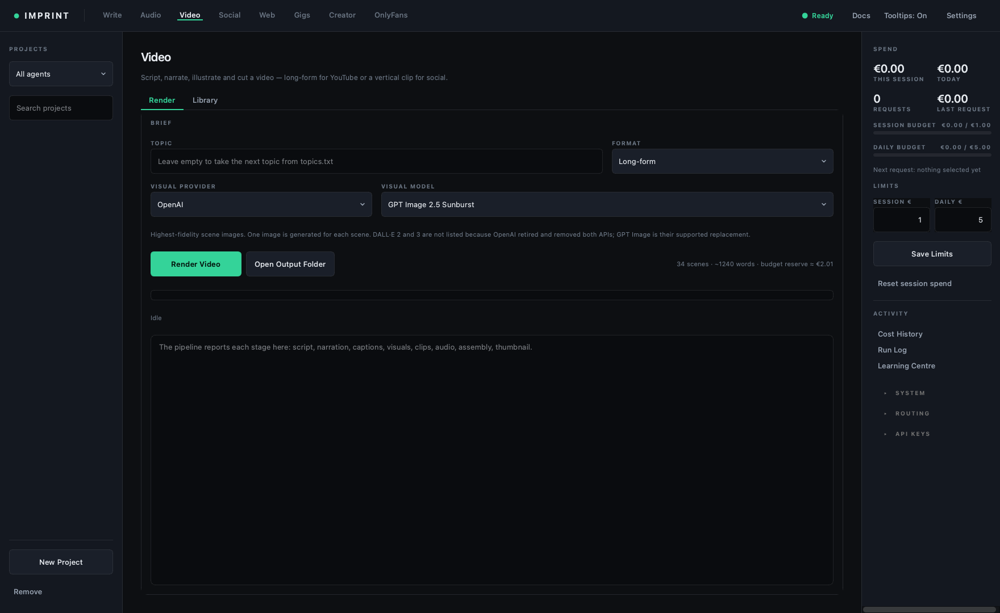
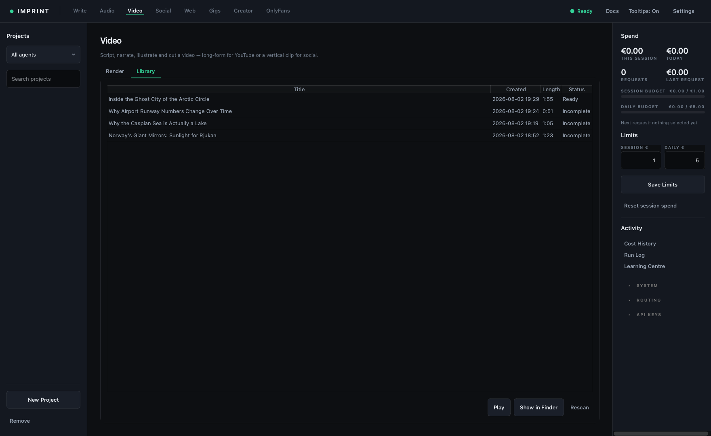
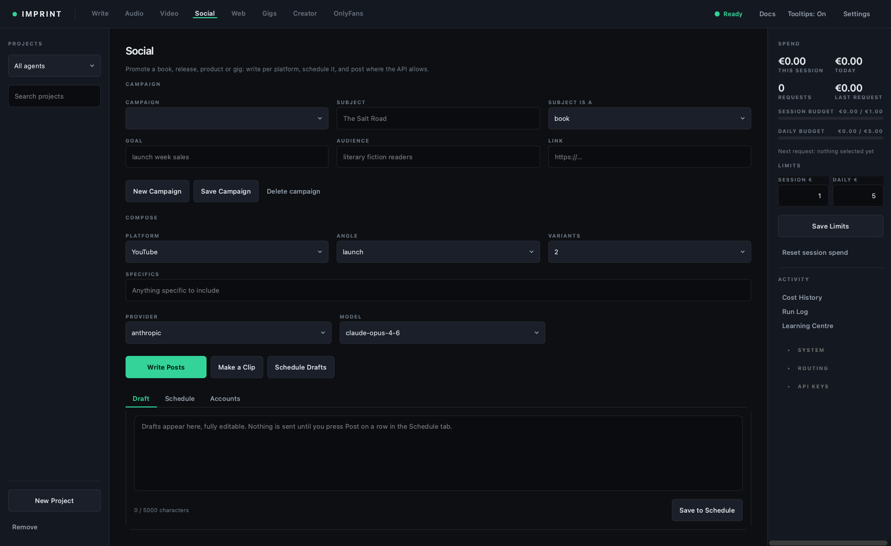
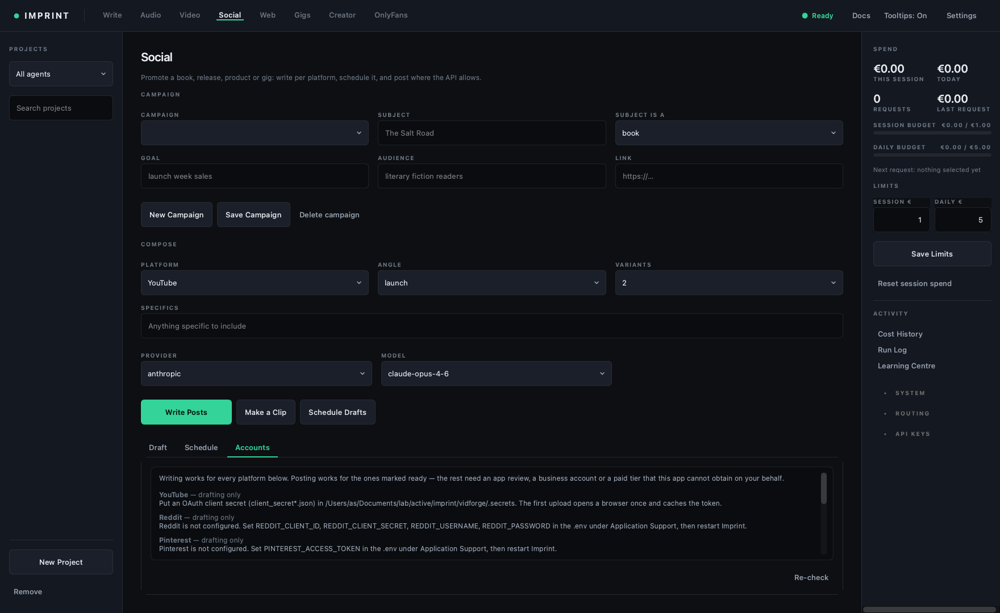

# 2 · The agents, one by one

Six agents across four modes. Each one has a `Docs` button that opens its own
reference sheet from `docs/agents/`; this page is the working guide.

---

## Write → Draft  *(author)*

Long-form drafting: outlines, characters, scenes, dialogue, world-building.

| Control | Use it for |
|---|---|
| `Direction:` | What to write **next**. One concrete instruction beats a paragraph of context. |
| `Task:` | The shape of the output — Write Scene, Outline, Character, and so on. |
| `Draft / Outline / Characters / World Notes / Chapters` | Separate documents that persist per project. |
| **Write** | A fresh pass from the Direction box. |
| **Continue** | Extends the existing draft. Use this far more than Write. |

**Working method that holds up:** outline first in the Outline tab, then write
scene by scene with a one-line Direction each time. Long prompts asking for
"chapter 3" produce mush; "the argument in the kitchen, she leaves angry"
produces a scene.

The word and scene counters are live — useful when a publisher wants 80,000
words and you need to know where you stand.

---

## Write → Publish  *(author, publish page)*

Turns a finished draft into the documents publishing actually asks for:
synopsis, blurb, query letter, one-page pitch.

`Comp Titles` matters more than it looks. "Gone Girl meets Dark Places" tells
the model the shelf, the tone and the reader in four words, and it is the field
most people leave blank.

---

## Write → Publish & Market → Market  *(author, market page)*

Store-facing copy: Amazon description, launch posts, newsletter copy. `Platform`
changes the format — an Amazon description and a social post are not the same
text with different lengths.

---

## Publish  *(manuscript)*

Sales tracking and the publishing todo list.

- **Ingest KDP CSV** — Amazon has no public API, so royalties arrive as CSV
  reports you download from KDP. This reads them into the app's database.
- **Refresh Data** / **Period** — the metrics view over what has been ingested.
- **Publishing Todos** — a seeded checklist per platform (KDP, Draft2Digital,
  IngramSpark, PublishDrive).
- **Ask about your book** — questions answered against your own ingested numbers.

---

## Audio → Audiobooks  *(audiobook)*

Converts an ebook (PDF / EPUB / TXT / MOBI) into MP3 via OpenAI TTS.

Costed per character, so a full novel is not trivial — check the estimate before
starting. The conversion runs as a separate process and can be stopped.

**Note:** the panel opens a dialog if its input folder holds no supported ebook.
Point it at a folder with real files before selecting it.

---

### Listening to what you made

The **Listen** tab is the library: every audio file in your output folder, with
progress and position. Select one and the button reads *Resume at 1:24:03* — it
picks up exactly there.

Position is remembered per file and saved while you listen, not only when you
stop, so closing the laptop mid-chapter does not lose your place. A book played
to the end is marked finished and starts over next time rather than resuming
three seconds from the end. **Start Over** resets one deliberately.

---

## Audio → Music  *(music)*

Release planning rather than audio generation: artist profile, release setup,
distributor comparison, Spotify pitch, income roadmap.

Output marks **[AI OUTPUT — COPY-PASTE READY]** against **[HUMAN ACTION
REQUIRED]**, so you always know which parts you still have to do yourself.

---

## Web → Site Builder  *(webdesign)*

HTML/CSS/JS generation with the result split across `HTML`, `CSS` and `JS` tabs
plus a line count.

Fill in `Colour Palette` and `Framework` — left blank, the model picks for you,
and its default taste is generic.

---

## Gigs → Client Gigs  *(fiverr)*

Logo concepts, gig descriptions, and client delivery messages.

**Generate Logos** is the paid, headline action — it bills per image, and that
now counts against your budget caps. Pick a current **GPT Image model** for the
quality/speed tradeoff. DALL·E 2 and 3 are not shown because their APIs were
removed. **Delivery Message** and **Gig Description** are text-only and cheap.
The Orders tab tracks what you produced for whom.

---

## Video → Video  *(video)*

Topic in, finished video out: script, narration, aligned captions, generated
visuals, Ken Burns motion, music and a thumbnail. This is the `vidforge`
pipeline running inside Imprint — the same code as the standalone app, not a
copy, so a render started in either shows up in both libraries.

Choose the visual route as well as the format:

| Choice | Result |
|---|---|
| **GPT Image 2.5 / GPT Image 2** | Generates scene images, then assembles the full narrated pipeline. Long-form or 15–90-second social clip. |
| **Sora 2 / Sora 2 Pro** | One direct 4, 8 or 12-second clip with audio. Retiring 24 September 2026. |
| **Gemini Omni 1.1 Flash** | One direct 3–10-second 720p clip with audio. |
| **Veo 3.1 / Fast / Lite** | One direct 4, 6 or 8-second 720p clip with audio. |
| **Wan 3.0 / Prime / 2.7** | One direct 2–30-second 720p clip through Qwen/Alibaba Model Studio. |
| **Higgsfield Seedance** | One direct clip after Imprint shows the exact provider quote. |
| **Pexels** | Stock scene visuals; needs a Pexels key. |
| **Local** | Local gradient scene cards; no image-generation charge. |

DALL·E does not appear because OpenAI removed the DALL·E 2 and 3 APIs. Choose a
current GPT Image model for the same scene-image role. DeepSeek, Anthropic,
Kimi and Ollama can still write the prompt or script, but they are not in the
visual menu because their APIs do not generate video.

The estimate beside the button is checked against your session and daily caps
before the run starts: a conservative reserve for GPT Image, selected 720p
per-second rates for Sora/Veo/Wan, a token-based reserve for Gemini Omni, or
Higgsfield's exact quote. Pexels and Local remove the image generation portion;
script and narration can still cost money.

**Stop** cancels a pipeline render at the next stage boundary or requests
Higgsfield cancellation. Sora, Gemini and Wan direct jobs cannot be safely
cancelled after submission here, so Imprint keeps watching and saves the paid
result.

---

## Social → Social  *(social)*

The funnel for everything else in the studio. A **campaign** is one subject —
a book, a release, a product, a gig — and its goal. Posts are written per
platform, laid on a schedule, and either posted directly or copied out.

Write for the platform, not for "social media". The same announcement is a
different piece of writing on each one, and not because of length: Reddit
removes posts that read as marketing, Pinterest is a search engine wearing a
mood board, X gives you seven words before someone scrolls. That guidance is
built into each platform's prompt.

**Angle** matters more than most people expect. `launch` is the one everyone
reaches for and the one that works least often; `behind_the_scenes`, `excerpt`
and `value` all give someone a reason to read who was not already going to buy.

**Make a Clip** is where Video and Social meet: it writes a topic brief, hands
it to the video pipeline at the right aspect and length for the platform, and
files the finished mp4 against the campaign. You are not maintaining two video
workflows.

**Schedule Drafts** spreads undated drafts across the coming weeks at each
platform's own cadence — seven a week on X, one a week on Reddit. That last
number is not timidity: posting more often than that on Reddit is how accounts
get banned, whatever the API allows.

### What can actually post

Writing works everywhere. Posting does not, and the Accounts tab is honest
about which is which:

| | |
|---|---|
| **YouTube, Reddit, Pinterest** | Can post today. Each needs credentials you can obtain yourself — see the tab for exactly which. |
| **X, Instagram, TikTok, Threads, LinkedIn** | Drafting only. Each needs a paid tier, a linked business account, or an app review that Imprint cannot obtain on your behalf. |

Nothing posts on its own. There is no scheduler running in the background and
no "publish all" — the schedule is a plan you work through, one confirmed click
at a time. That is deliberate: a tool that posts unattended is how an account
gets banned for something its owner never saw.

---

## Creator → Creator  *(creator)*

Planning and drafting for subscription creator accounts: content calendar,
captions, PPV copy, welcome messages, off-platform promos, and earnings.

**It does not post.** OnlyFans has no usable API, and the tools that fake one
get accounts permanently banned — so this drafts and you send. That is also the
only kind of automation their terms allow: the kind that assists a human rather
than replacing one.

| Tab | What it holds |
|---|---|
| Draft | The generated copy, editable. |
| Calendar | What is queued, and what each item earned once you record it. |
| Earnings | Imported statements, price points that actually converted, top content. |
| Voice | The account's own writing samples — the single biggest lever on quality. |
| Media | Photosets, clips, and anything Higgsfield rendered. |
| Agency | Every account side by side, for managed work. |
| Records | That age and identity documents exist for anyone depicted, and where. |

**Fill in Voice first.** Paste five of the account's own posts. Everything the
agent writes afterwards imitates them, and without that step the drafts are
competent and completely generic — the difference is larger than any other
setting in the app.

Accounts are typed **own**, **managed** or **persona**. A managed account —
someone else's, run on their behalf — will not draft until you record who
authorised it. A persona carries a character bible and a locked seed so it stays
one character instead of becoming a new one each session.

`Generate Teaser` renders promo video through Higgsfield. It is safe-for-work
by construction: Higgsfield prohibits explicit material and moderates prompts,
reference images and outputs, so explicit content has to come from elsewhere.
Its role is the teaser that lives on X or Reddit. Imprint shows Higgsfield's
estimate before asking permission to spend, lets you cancel while the request
is queued, saves the completed file locally, and attaches it to the selected
Calendar row.

---

Next: [Making money with it](03-profit.md)
