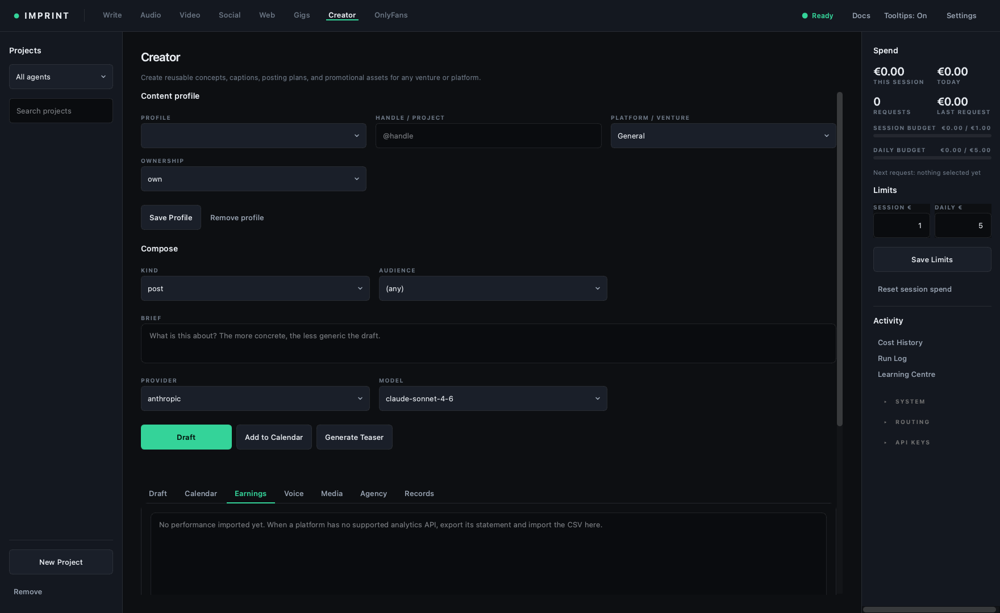

# Creator

> **Outcome:** create one authorised campaign asset, keep identity/consent and
> public actions human-controlled, and connect the asset to an owned result.

## Prerequisites

- An `own`, `managed`, or accurately disclosed `persona` profile.
- Recorded authorisation for managed work; disclosure for synthetic personas.
- Performer identity/age/consent/release records where applicable.
- One bounded campaign hypothesis, account, segment, and measurement window.

## Profile and compose controls

| Control | Meaning |
|---|---|
| Profile / Handle / Platform | Durable account/project identity and destination context |
| Ownership | `own`, `managed`, or `persona`; changes required safeguards |
| Authorised by | Required evidence for managed accounts, including who and when |
| Disclosure | How a synthetic persona is truthfully disclosed |
| Save Profile / Remove profile | Persist or remove profile state; preserve required records first |
| Kind | post, caption, campaign, posting_plan, promo_assets, hooks, bio, ppv, welcome, promo |
| Price / Audience / Promo channel | Conditional experiment fields; not all appear for every kind |
| Brief / Provider / Model / Draft | Bounded content request and local Best Fit route |
| Add to Calendar | Saves reviewed output as a prepared schedule item |
| Generate/Cancel Teaser | Paid Higgsfield SFW promotional render and provider-dependent cancellation |
| Stop | Stops active text generation locally where possible |

## Seven output tabs

| Tab | How to use it |
|---|---|
| Draft | Editable output. Nothing is sent automatically; review then post manually. |
| Calendar | When, kind, title, price, status. Prepared state is not published state. |
| Earnings | Import Earnings CSV or Record Revenue. Receipts are not profit without matching cost/period. |
| Voice | Manage authorised voice/character settings and test samples before use. |
| Media | Add Media with kind, source, caption, and rights/provenance. |
| Agency | Compare accounts/types/authorisation/net receipts/subscribers/draft counts cautiously. |
| Records | Performer, verification, ID-on-file, release, and records location; presence is not legal sufficiency. |

## Worked run

1. Select/create a profile and ownership type. Complete the conditional
   authorisation or disclosure fields and save.
2. Choose one Kind, segment/channel, price if applicable, and a brief with
   audience, offer, proof boundary, CTA, and prohibited claims.
3. Draft once. Review voice, facts, disclosure, consent, platform fit, and CTA.
4. Add the approved item to Calendar; do not imply it was posted.
5. Add only authorised media/voice references with source/provenance.
6. For a teaser, confirm SFW content, estimate, provider policy, likeness rights,
   and cancellation boundary before submission.
7. Later import the platform statement or Record Revenue with source/window.
   Keep acquisition, production, fees, refunds, human time, and currency beside it.

## How to read the output and analytics

Draft/calendar/media counts are production observations. Imported net receipts
are `OBSERVED` only for their source/window, not profit or LTV. Revenue per
posted asset is not conversion without exposure and purchase denominators.
Subscriber totals from another date cannot be used as cohort retention.

## Acceptance checklist

- [ ] Ownership, authorisation/disclosure, identity, age, consent, and releases pass.
- [ ] No impersonation, unauthorised likeness/voice, private material, or false claim.
- [ ] Public interaction/posting and money movement remain human-controlled.
- [ ] Calendar/status describes reality; imported actuals preserve source/window/currency.
- [ ] The content links to one measurable intended or paid action.

## Cost, cancellation, and gates

Include text/media/video, retries, production, moderation, messaging, promotion,
fees, refunds, and human time. Cancel Teaser can fail after provider acceptance;
preserve and save a paid result rather than submitting duplicates.

## Common failures

**Managed/persona fields disappear:** verify Ownership; conditional fields are
intentional.  
**Earnings look high:** match the period/currency and subtract all relevant
costs; do not infer LTV.  
**No posting button:** Creator intentionally produces drafts; a human publishes.

## Done when

The asset and profile pass the safeguards, the prepared/public state is honest,
and an owned outcome can later be joined without invented attribution.

## Next action

For OnlyFans opportunity selection, continue to [OnlyFans](29-onlyfans.md); for
measurement, create an [evidence passport](30-evidence.md).
