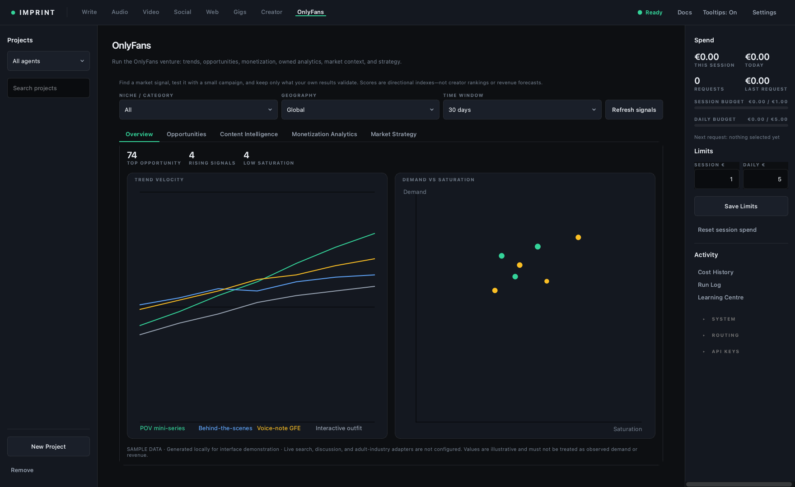
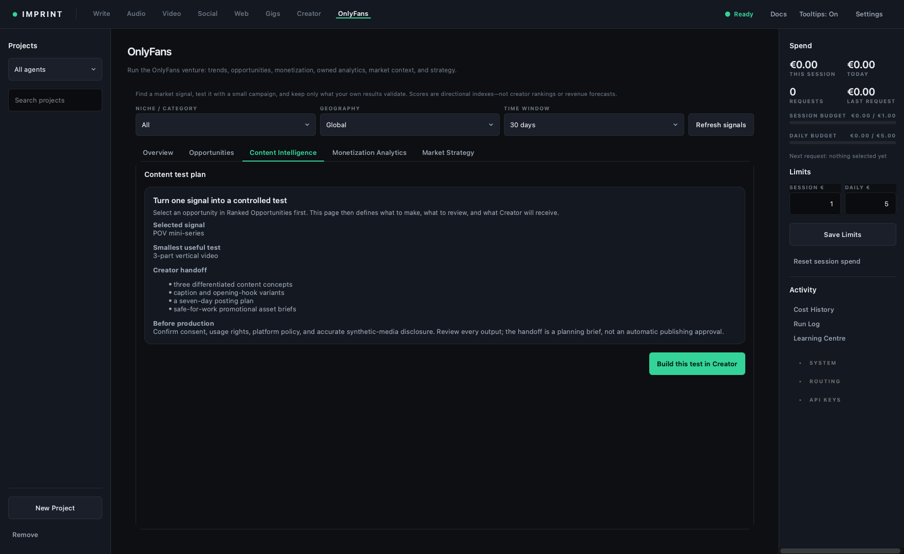

# OnlyFans

> **Outcome:** select one directional opportunity, convert it into a bounded
> Creator experiment, and state precisely what each dashboard can and cannot
> establish.

## Prerequisites

- An authorised/disclosed Creator profile with required records.
- A budget, time window, qualified-opportunity definition, and human gates.
- Understanding that demonstration data and scores are not demand or forecasts.

## Control atlas: filters and source state

**Niche / category**, **Geography**, and **Time window** change the signal cohort.
**Refresh signals** recomputes from the configured source. The source note must
say whether rows are live/configured or a demonstration dataset and when they
were observed. Never compare different windows/geographies as one cohort.

## Five tabs

| Tab | Output | Correct use |
|---|---|---|
| Overview | Top opportunity, rising/low-saturation counts, velocity, demand-vs-saturation charts | Orient among directional signals; inspect source before acting |
| Opportunities | Ranked Fit, Signal, Momentum, Demand, Competition, Revenue fit, Risk | Select one row; scores prioritise tests and do not predict income |
| Content Intelligence | Evidence summary, content test, selected-row details, Build this test in Creator | Convert one hypothesis into a bounded content experiment |
| Monetization Analytics | Pricing/monetization hypothesis plus owned Creator actuals when available | Separate suggested price from observed receipts, costs, purchases, and cohorts |
| Market Strategy | Market context, risks, channel/positioning test, decision guidance | Produce one next decision with safeguards—not a broad strategy dump |

## Score interpretation

Fit is a weighted ranking derived from the displayed signal dimensions and
risk treatment. Momentum is rate-of-change signal, Demand is interest proxy,
Competition is saturation/offer pressure, Revenue fit is compatibility with a
monetization route, and Risk flags review. The exact source and weighting belong
with the selected row. None is observed willingness to pay.

## Worked run

1. Choose geography/window and refresh. Read the source note before the chart.
2. In Opportunities, select one row with acceptable risk after comparing Fit,
   Demand, and Competition. Do not choose the highest score blindly.
3. Read all three detail tabs. Identify evidence label, missing denominator,
   pricing hypothesis, audience/channel, content test, and risk.
4. Press **Build this test in Creator** or **Create Campaign in Creator**. Imprint
   switches to Creator, selects OnlyFans/campaign, and loads a brief.
5. Select an authorised profile, reduce the brief to one primary outcome and
   guardrails, then draft/review manually.
6. Record exposures/profile visits/offers/purchases/refunds/net receipts,
   production/promotional cost, and human time for the fixed window.
7. Return to the decision rule: stop, repair, repeat, or scale. Do not relabel
   demo/proxy/model output as observed.

## How to read the output

`DEMO` rows only demonstrate interaction. `PROXY` trend/search/community data
can form a hypothesis. Creator imports can provide `OBSERVED` receipts but may
lack exposure, attribution, costs, or cohort retention. Missing fields remain
unavailable; they are not zero.

## Acceptance checklist

- [ ] Source, observed date, window, geography, evidence type, and limitations are visible.
- [ ] One selected row drives all detail tabs and the Creator handoff.
- [ ] Risk, consent, identity, disclosure, rights, and public interaction gates pass.
- [ ] Price remains a hypothesis until tested against owned paid outcomes.
- [ ] Rates retain numerator/denominator; receipts are not called profit/LTV.

## Cost, cancellation, and gates

Include Creator production, teaser media, promotion, platform/payment fees,
refunds, records/compliance work, and human messaging/review time. Never
automate identity/age/consent decisions, direct interaction, posting, payment,
or platform-rule circumvention.

## Verification

Reopen the selected opportunity and confirm that its source/window, evidence
label, Creator brief, raw outcome counts, costs, and decision record all refer
to the same experiment.

## Common failures

**Scores look precise:** inspect the source and underlying fields; index points
are not probabilities.  
**Monetization shows actual receipts:** confirm matching period/currency/cost;
it still may not support contribution or attribution.  
**Tabs seem disconnected:** select a row in Opportunities first.

## Done when

One opportunity has become a pre-registered Creator test with an evidence
passport, owned counts, full cost/time capture, safeguards, and one decision.

## Next action

Formalise the test in [Design a fair experiment](32-experiment.md) and evaluate
it with [Uncertainty and decisions](35-uncertainty-decisions.md).
